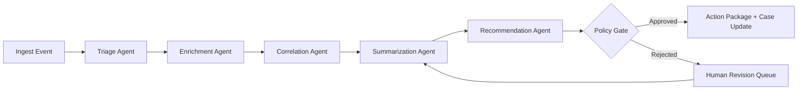

# ClearGlassInc Artemis — Self-Evolving AI Intelligence Platform

## 1) System Architecture

### 1.1 Architecture overview (Palantir-native)

```text
[Web UI: Analyst/Commander Ops Console]
    -> [API Gateway + BFF]
    -> [Mission Services (Case, Alert, Task, Intel Product)]
    -> [Event Bus (Kafka/PubSub)]
    -> [Foundry Pipelines + Ontology + Data Products]
    -> [AIP Agent Runtime + Copilots + Evals + Prompt Registry]
    -> [Gotham Operational Workspace + Investigations]
    -> [Search/Retrieval + Feature Store + Model Router]
    -> [Policy Engine + PDP/PEP + ABAC/ReBAC + Guardrails]
    -> [Observability + Audit + Drift Monitoring]
    -> [Apollo Deployment Control + Progressive Delivery]
```

### 1.2 Layered stack

- **Frontend (React/TypeScript)**: Mission dashboard, map/timeline graph view, case workspace, approval queue, policy explainability panel.
- **Backend (Python FastAPI + gRPC)**: case lifecycle, incident triage orchestration, ontology query facade, action package generator.
- **Event/streaming**: high-throughput event ingestion (SIGINT-like feeds, cyber telemetry, HUMINT reports, OSINT feeds).
- **Data layer (Foundry)**: bronze/silver/gold data products, quality contracts, schema evolution controls, temporal snapshots.
- **Ontology layer (Foundry Ontology + Gotham entities)**: entities, relationships, mission context, confidence/lineage, security labels.
- **AI layer (AIP)**: copilots + multi-agent workflows + eval harness + prompt/workflow registry.
- **Policy layer**: policy-as-code, runtime enforcement, high-risk action approvals.
- **Observability**: metrics, traces, model quality, mission outcomes, operator trust index.
- **Deployment/runtime (Apollo)**: secure rollout, canary, rollback, isolated environment promotion.

### 1.3 Service decomposition

```yaml
services:
  api-gateway:
    responsibilities: [authn, rate-limit, request-shaping, tenant-routing]
  mission-service:
    responsibilities: [case-open, case-update, assignment, SLA tracking]
  triage-service:
    responsibilities: [signal-normalization, scoring, prioritization]
  ontology-query-service:
    responsibilities: [entity graph queries, temporal joins, lineage retrieval]
  agent-orchestrator:
    responsibilities: [planner, tool routing, approvals, execution graph]
  policy-decision-service:
    responsibilities: [ABAC/ReBAC decisions, coalition guardrails, break-glass policy]
  evaluation-service:
    responsibilities: [offline/online evals, A/B analysis, drift detectors]
  self-improvement-service:
    responsibilities: [proposal generation, safe-change bundles, rollback hooks]
```

---

## 2) Data and Ontology

### 2.1 Canonical entity model

```sql
-- Core identity & operational entities (lakehouse + ontology sync)
CREATE TABLE entity_person (
  person_id STRING PRIMARY KEY,
  canonical_name STRING,
  aliases ARRAY<STRING>,
  nationality STRING,
  confidence DOUBLE,
  first_seen TIMESTAMP,
  last_seen TIMESTAMP,
  security_label STRING,
  lineage_json JSON
);

CREATE TABLE entity_asset (
  asset_id STRING PRIMARY KEY,
  asset_type STRING,
  owner_entity_id STRING,
  geohash STRING,
  confidence DOUBLE,
  valid_from TIMESTAMP,
  valid_to TIMESTAMP,
  mission_context_id STRING,
  lineage_json JSON
);

CREATE TABLE rel_entity_link (
  src_entity_id STRING,
  dst_entity_id STRING,
  rel_type STRING,
  confidence DOUBLE,
  asserted_by STRING,
  evidence_refs ARRAY<STRING>,
  valid_from TIMESTAMP,
  valid_to TIMESTAMP,
  classification STRING,
  PRIMARY KEY (src_entity_id, dst_entity_id, rel_type, valid_from)
);
```

### 2.2 Ontology primitives (Foundry/Gotham aligned)

- **Object Types**: Person, Organization, Asset, Communication, Event, Location, Mission, Case, Alert.
- **Links**: communicated_with, co_located_at, owns, controls, observed_in, escalated_to_case, linked_to_mission.
- **Traits**: confidence score, source reliability, temporal validity, compartment, coalition releasability.
- **Actions**: open_case, request_collection, recommend_interdiction, publish_intel_brief.

### 2.3 Confidence, lineage, temporal state

- Every assertion carries: `confidence`, `source_reliability`, `inference_method`, `model_version`, `policy_context`.
- Temporal reasoning is bitemporal (`event_time`, `system_time`) to replay prior operational views.
- Lineage references immutable evidence artifacts and transformation job IDs.

### 2.4 Permissions model

- **Need-to-know** + mission assignment constraints.
- Row/column/entity-level masking with dynamic policy predicates.
- Coalition boundary filters (e.g., releasable metadata vs restricted payload).

---

## 3) AI and Agent Design

### 3.1 Copilots

1. **Analyst Copilot**: hypothesis generation, entity disambiguation, timeline summarization, evidence citation.
2. **Commander Copilot**: mission risk heatmap, recommendation confidence bands, decision memo drafts.

### 3.2 Multi-agent workflow graph



### 3.3 Tool-using agents (AIP)

- Query tools: ontology search, vector retrieval, temporal graph query.
- Action tools: create/update case, assign task, generate intel brief, notify watch floor.
- Guarded tools: any operationally significant action requires explicit human approval token.

### 3.4 Approval gates

- Gate conditions: mission criticality, estimated harm, confidence below threshold, policy-sensitive jurisdiction.
- Required artifacts for approval: rationale, source evidence, counterfactual options, confidence interval.

---

## 4) Self-Improvement Loop (Safe)

### 4.1 Feedback capture

Signals ingested continuously:
- operator edits/corrections,
- action approvals/rejections,
- false positive/false negative adjudication,
- response latency,
- mission outcome tags.

```python
# feedback_ingest.py
from pydantic import BaseModel
from datetime import datetime

class FeedbackEvent(BaseModel):
    event_id: str
    workflow_id: str
    operator_id: str
    signal_type: str  # correction | approval | rejection | outcome
    payload: dict
    timestamp: datetime
    mission_id: str


def normalize_feedback(evt: FeedbackEvent) -> dict:
    return {
        "event_id": evt.event_id,
        "workflow_id": evt.workflow_id,
        "signal_type": evt.signal_type,
        "delta": evt.payload,
        "mission_id": evt.mission_id,
        "ts": evt.timestamp.isoformat(),
    }
```

### 4.2 Proposal engine (not autonomous deployment)

- Generate candidate improvements for:
  - prompt templates,
  - tool routing policy,
  - workflow branching heuristics,
  - model router thresholds.
- Package as **Change Proposal** with expected metric impact and blast-radius estimate.

```python
# proposal_engine.py
def propose_prompt_change(prompt_version, eval_failures):
    common_failures = cluster_failures(eval_failures)
    patch = synthesize_patch(prompt_version.text, common_failures)
    return {
        "type": "prompt_patch",
        "target": prompt_version.id,
        "patch": patch,
        "expected": {"precision_gain": 0.04, "latency_delta_ms": 12},
        "risk": "low",
    }
```

### 4.3 Evaluation and A/B gating

- Offline replay on labeled historical missions.
- Shadow mode on live traffic.
- Canary rollout to controlled analyst cohorts.
- Promotion requires threshold pass on precision/recall/trust + no policy regression.

```yaml
promotion_policy:
  min_precision_delta: 0.02
  min_recall_delta: 0.01
  max_latency_regression_ms: 40
  min_operator_trust_delta: 0.0
  policy_violations_allowed: 0
  required_approvers: [mission_lead, legal_ops, ai_governance]
```

### 4.4 Versioning, rollback, drift

- Version everything: prompts, tools, workflows, policies, models.
- Drift detectors: data schema drift, concept drift, behavior drift.
- One-click Apollo rollback to last known-good bundle.

---

## 5) Full-Stack Implementation Blueprint

### 5.1 Web UI (TypeScript/React)

- **Views**: Live Alerts, Entity Graph, Mission Timeline, Case Board, Approval Inbox, Evals Dashboard.
- **Key UX**: explainability drawer showing evidence lineage + policy rationale.

```ts
// api/approvals.ts
export async function submitApproval(actionId: string, decision: "approve" | "reject", reason: string) {
  const res = await fetch(`/api/v1/actions/${actionId}/decision`, {
    method: "POST",
    headers: { "Content-Type": "application/json" },
    body: JSON.stringify({ decision, reason })
  });
  if (!res.ok) throw new Error("Approval submission failed");
  return res.json();
}
```

### 5.2 API gateway + backend services (Python)

```python
# app/main.py
from fastapi import FastAPI, Depends
from app.policy import enforce_action_policy
from app.schemas import ActionDecision

app = FastAPI(title="ClearGlassInc Artemis Mission API")

@app.post("/api/v1/actions/{action_id}/decision")
def decide_action(action_id: str, payload: ActionDecision, user=Depends(auth_user)):
    enforce_action_policy(user, action_id, payload.decision)
    result = record_decision(action_id, user.user_id, payload.decision, payload.reason)
    publish_event("action.decision.recorded", result)
    return {"status": "ok", "result": result}
```

### 5.3 Event bus

```python
# app/events.py
def publish_event(topic: str, payload: dict):
    producer.send(topic, value=payload)

@consumer.subscribe("intel.raw.events")
def handle_raw_event(evt: dict):
    normalized = normalize_event(evt)
    publish_event("intel.normalized.events", normalized)
```

### 5.4 Search/retrieval + ontology query

```python
# app/tools/ontology_tool.py
def find_related_entities(entity_id: str, horizon_hours: int = 72):
    query = """
    MATCH (e {id: $entity_id})-[r]->(n)
    WHERE r.valid_from >= datetime() - duration({hours: $horizon_hours})
    RETURN n.id, type(r) AS rel_type, r.confidence
    ORDER BY r.confidence DESC
    LIMIT 200
    """
    return graph.run(query, entity_id=entity_id, horizon_hours=horizon_hours)
```

### 5.5 Model router / inference layer

```python
# app/ai/router.py
def route_model(task_type: str, sensitivity: str, latency_budget_ms: int):
    if sensitivity == "high" and task_type in {"recommendation", "targeting_summary"}:
        return "governed-large-model-v3"
    if latency_budget_ms < 300:
        return "fast-small-model-v5"
    return "balanced-model-v4"
```

### 5.6 Workflow state machine

```python
# app/workflows/triage_machine.py
from enum import Enum

class State(str, Enum):
    INGESTED = "ingested"
    TRIAGED = "triaged"
    ENRICHED = "enriched"
    CORRELATED = "correlated"
    RECOMMENDED = "recommended"
    PENDING_APPROVAL = "pending_approval"
    EXECUTED = "executed"
    CLOSED = "closed"
```

### 5.7 Observability and eval dashboards

- Metrics: precision@k, recall@k, latency p95, policy violation count, analyst override rate, trust score.
- Tracing: per-agent span with tool calls and retrieved evidence IDs.
- Dashboards: mission impact vs model/workflow version.

---

## 6) Security and Governance

### 6.1 Zero-trust and compartmentalization

- Mutual TLS between all services.
- Signed workload identity tokens.
- Compartment tags enforced at query + response layers.

### 6.2 AuthN/AuthZ and policy enforcement

```python
# app/policy.py
def enforce_action_policy(user, action_id: str, decision: str):
    ctx = build_policy_context(user, action_id, decision)
    verdict = policy_engine.evaluate("action_decision", ctx)
    if not verdict.allowed:
        raise PermissionError(f"Denied: {verdict.reason}")
```

### 6.3 Immutable provenance

- Every AI response stores prompt hash, model id, tool-call trace, source IDs, policy decision IDs.
- Append-only audit log with cryptographic sealing.

### 6.4 Model/prompt/workflow governance

- Registry with signed artifacts and semantic versioning.
- Mandatory human approval for:
  - policy changes,
  - high-risk prompt updates,
  - routing changes affecting mission-critical actions.

---

## 7) Code Examples (End-to-End Wiring)

### 7.1 Agent tool call with approval requirement

```python
# app/ai/agents/recommendation_agent.py
class RecommendationAgent:
    def run(self, case_id: str):
        facts = tools.ontology.fetch_case_facts(case_id)
        rec = llm.generate_recommendation(facts)

        if rec["operational_significance"] == "high":
            approval_id = tools.approvals.create_gate(
                case_id=case_id,
                recommendation=rec,
                rationale=rec["rationale"],
                confidence=rec["confidence"],
            )
            return {"status": "pending_approval", "approval_id": approval_id}

        tools.case.apply_recommendation(case_id, rec)
        return {"status": "applied", "recommendation": rec}
```

### 7.2 Eval pipeline (batch)

```python
# app/evals/run_eval.py
def run_eval_suite(candidate_bundle_id: str, baseline_bundle_id: str, dataset_id: str):
    baseline = evaluate_bundle(baseline_bundle_id, dataset_id)
    candidate = evaluate_bundle(candidate_bundle_id, dataset_id)

    report = compare_metrics(baseline, candidate)
    report["pass"] = (
        report["precision_delta"] >= 0.02 and
        report["recall_delta"] >= 0.01 and
        report["policy_violations"] == 0
    )
    persist_eval_report(report)
    return report
```

### 7.3 Drift detector

```python
# app/monitoring/drift.py
def detect_behavior_drift(current_window, baseline_window):
    kl = kl_divergence(current_window["class_probs"], baseline_window["class_probs"])
    override_shift = current_window["analyst_override_rate"] - baseline_window["analyst_override_rate"]
    return {
        "behavior_drift": kl > 0.15 or override_shift > 0.08,
        "kl_divergence": kl,
        "override_shift": override_shift,
    }
```

---

## 8) Scenario Walkthrough (Cinematic + Technical)

### T+00:00 — Live event ingestion
A maritime telemetry event plus encrypted comms metadata arrives. Ingestion pipeline normalizes and tags it as Mission `M-2047` with coalition compartment labels.

### T+00:05 — Automated triage
Triage Agent scores urgency 0.87 due to correlation with a known smuggling network node. Event enters **priority queue** and case draft is created.

### T+00:20 — Multi-agent enrichment/correlation
Enrichment Agent pulls historical sightings + financial anomalies. Correlation Agent identifies repeated co-location pattern over last 11 days and raises confidence from 0.62 to 0.81.

### T+00:35 — Recommendation generated
Recommendation Agent proposes: “initiate targeted collection request + interagency notification.” Because operational impact is high, policy gate marks it **human approval required**.

### T+01:00 — Operator decision
Commander reviews evidence chain, rejects one sub-action (interagency blast) but approves targeted collection. Rejection rationale: coalition disclosure risk.

### T+01:05 — Learning signal captured
System records:
- rejected action subtype,
- policy rationale,
- adjusted recommendation accepted by commander,
- final mission outcome after 24h.

### T+24:00 — Self-improvement cycle
Evaluation service replays similar historical cases and learns that coalition-sensitive contexts require stricter recommendation templates. Proposal engine suggests prompt patch and routing heuristic update.

### T+25:00 — Governance approval + controlled rollout
AI Governance Board approves low-risk prompt patch and heuristic update for shadow + 10% canary. Metrics improve: precision +3.1%, no policy regressions, latency +9ms.

### T+48:00 — Promotion
Apollo promotes bundle to production with signed release artifact. Audit trail links mission outcome -> eval report -> approval record -> deployed bundle version.

---

## 9) Implementation Roadmap

### Phase 1 (0–90 days)
- Build ingestion, ontology baseline, case service, analyst copilot v1.
- Stand up policy engine and approval queue.

### Phase 2 (90–180 days)
- Add multi-agent orchestration, model router, eval harness.
- Launch shadow-mode self-improvement proposals.

### Phase 3 (180–270 days)
- Enable governed canary promotions, automatic rollback, drift-driven safeguards.
- Harden coalition-aware segmentation and mission-level SLO dashboards.

### Phase 4 (270+ days)
- Continuous learning with strict human-in-the-loop approvals.
- Mature trust calibration and mission impact forecasting.

This design gives **ClearGlassInc Artemis** an auditable, policy-governed, self-improving intelligence platform that accelerates decision quality without permitting unsafe autonomy.
