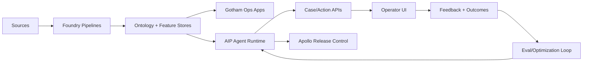

# ClearGlassInc Artemis: Self-Evolving Intelligence Platform Blueprint

## System Architecture

### 1) Full-stack topology
- **Frontend**: mission web console (React/TypeScript), analyst copilot panes, command dashboards.
- **API gateway**: policy-aware ingress, request signing, rate controls.
- **Backend services (Python/FastAPI)**: investigation service, case service, workflow orchestrator.
- **Event mesh**: Kafka/Pulsar topics for telemetry, alerts, and operator feedback.
- **Data layer (Foundry)**: ontology-backed lakehouse, transforms, lineage, and quality checks.
- **Operational layer (Gotham)**: investigations, entity tracking, temporal graph exploration.
- **AI layer (AIP)**: copilots, agents, eval runners, model routing.
- **Deployment layer (Apollo)**: secure rollout rings, runtime policies, rollback orchestration.



## Data and Ontology

### Core entities
- `Person`, `Organization`, `Device`, `Location`, `Event`, `Case`, `Mission`, `Indicator`, `Alert`, `ActionPackage`.
- every entity has: `classification`, `source_reliability`, `confidence`, `lineage_ref`, `time_valid_from`, `time_valid_to`.

### Relationship examples
- `Person -> uses -> Device`
- `Alert -> references -> Indicator`
- `Case -> linked_to -> Mission`
- `ActionPackage -> approved_by -> Operator`

```sql
CREATE TABLE ontology_alert (
  alert_id STRING PRIMARY KEY,
  mission_id STRING,
  severity STRING,
  confidence DOUBLE,
  source_reliability DOUBLE,
  observed_at TIMESTAMP,
  classification STRING,
  lineage_ref STRING,
  status STRING
);

CREATE TABLE ontology_feedback (
  feedback_id STRING PRIMARY KEY,
  alert_id STRING,
  operator_id STRING,
  verdict STRING,
  correction JSON,
  created_at TIMESTAMP
);
```

## AI and Agent Design

### Agent roles (AIP)
1. **Triage Agent**: severity scoring and routing.
2. **Enrichment Agent**: fetches entity context and historical correlations.
3. **Correlation Agent**: graph pattern analysis and hypothesis generation.
4. **Intel Draft Agent**: creates briefing products and action packages.
5. **Policy Gate Agent**: executes policy checks and approval requirements.

### Human approval gates
- Any operationally significant action (`open case`, `dispatch recommendation`, `cross-domain share`) requires `HUMAN_APPROVAL_REQUIRED=true` and an assigned approver.

## Self-Improvement Loop

1. Capture signals: prompts, completions, operator edits, accepted/rejected recommendations, mission outcomes.
2. Build eval sets daily from recent closed cases.
3. Run candidate prompts/models/workflows against holdout + replay datasets.
4. Score by precision, recall, latency, trust score, and mission impact.
5. Propose upgrade package with risk assessment.
6. Human review board approves/rejects.
7. Apollo deploys to canary ring.
8. Drift monitors decide promote/rollback.

```python
# backend/evals/pipeline.py
from dataclasses import dataclass
from typing import List

@dataclass
class EvalResult:
    candidate_id: str
    precision: float
    recall: float
    p95_latency_ms: int
    operator_trust: float

PROMOTION_RULES = {
    "min_precision_gain": 0.02,
    "max_latency_regression_ms": 40,
    "min_operator_trust": 0.9,
}

def should_promote(base: EvalResult, cand: EvalResult) -> bool:
    return (
        (cand.precision - base.precision) >= PROMOTION_RULES["min_precision_gain"]
        and (cand.p95_latency_ms - base.p95_latency_ms) <= PROMOTION_RULES["max_latency_regression_ms"]
        and cand.operator_trust >= PROMOTION_RULES["min_operator_trust"]
    )
```

## Full-Stack Implementation

```python
# backend/api/main.py
from fastapi import FastAPI, Depends, HTTPException
from pydantic import BaseModel

app = FastAPI(title="ClearGlassInc Artemis Gateway")

class AlertIn(BaseModel):
    alert_id: str
    mission_id: str
    payload: dict

@app.post("/v1/alerts/ingest")
def ingest_alert(alert: AlertIn, principal=Depends(...)):
    # 1) policy check
    # 2) write to event bus
    # 3) return tracking id
    return {"status": "accepted", "alert_id": alert.alert_id}
```

```python
# backend/workflows/state_machine.py
from enum import Enum

class Stage(str, Enum):
    TRIAGE="triage"
    ENRICH="enrich"
    CORRELATE="correlate"
    DRAFT="draft"
    APPROVAL="approval"
    EXECUTE="execute"

TRANSITIONS = {
    Stage.TRIAGE: Stage.ENRICH,
    Stage.ENRICH: Stage.CORRELATE,
    Stage.CORRELATE: Stage.DRAFT,
    Stage.DRAFT: Stage.APPROVAL,
}
```

```typescript
// frontend/src/api/cases.ts
export async function approveAction(caseId: string, actionId: string, token: string) {
  const res = await fetch(`/v1/cases/${caseId}/actions/${actionId}/approve`, {
    method: "POST",
    headers: { "Authorization": `Bearer ${token}` }
  });
  if (!res.ok) throw new Error("Approval failed");
  return res.json();
}
```

## Security and Governance

- Zero-trust service identity with mutual TLS and short-lived credentials.
- Need-to-know enforcement at row/column/entity layer.
- Coalition partitions with explicit cross-domain guards.
- Immutable provenance ledger for model, prompt, and decision versions.
- Policy-as-code for data access, tool permissions, and action constraints.

```python
# backend/policy/checks.py

def can_execute_action(user, action, context):
    if action.classification > user.clearance:
        return False, "insufficient_clearance"
    if context.coalition not in user.allowed_coalitions:
        return False, "coalition_boundary"
    if action.operational_significance and not context.human_approved:
        return False, "human_approval_required"
    return True, "ok"
```

## Scenario Walkthrough

1. A SIGINT anomaly arrives through streaming ingest.
2. Triage Agent assigns high severity with 0.82 confidence.
3. Enrichment Agent links the signal to a known device cluster and mission timeline.
4. Correlation Agent detects pattern overlap with prior incidents.
5. Intel Draft Agent proposes an action package and confidence rationale.
6. Policy Gate Agent blocks auto-execution and requests commander approval.
7. Commander rejects recommendation and applies correction.
8. Feedback event is stored, added to eval corpus, and weighted in trust scoring.
9. Candidate workflow update is proposed; review board approves canary release.
10. Apollo deploys, monitors drift and KPI deltas, then promotes after stability window.
