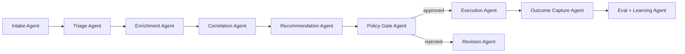

# ClearGlassInc Artemis — Extreme Self-Evolving Intelligence System (Palantir-Native)

## System Architecture

### 1) End-to-end layered architecture

```text
┌────────────────────────────────────────────────────────────────────────────────────────────┐
│ Mission Web UI (React/TypeScript), Gotham operational views, Foundry operational apps     │
│ - Analyst Copilot UI, Commander Decision UI, Case Timeline, Explainability + Audit Panel  │
└────────────────────────────────────────────────────────────────────────────────────────────┘
                                 │
                                 ▼
┌────────────────────────────────────────────────────────────────────────────────────────────┐
│ API Gateway + BFF                                                                            │
│ - FastAPI gateway (Python), GraphQL facade, mTLS, JWT validation, ABAC context injection   │
└────────────────────────────────────────────────────────────────────────────────────────────┘
                                 │
                                 ▼
┌────────────────────────────────────────────────────────────────────────────────────────────┐
│ Service Mesh (Zero-Trust Runtime)                                                           │
│ - Ingestion, Entity Resolution, Case Service, Recommendation Service, Policy Service        │
│ - Mission Workflow Orchestrator, Eval Service, Prompt Registry Service                      │
└────────────────────────────────────────────────────────────────────────────────────────────┘
     │                          │                            │
     ▼                          ▼                            ▼
┌───────────────┐       ┌─────────────────────────┐   ┌────────────────────────────────────┐
│ Event Bus     │       │ Data + Ontology Layer   │   │ AI Orchestration Layer (AIP)      │
│ Kafka/Pulsar  │──────▶│ Foundry lakehouse       │──▶│ Agent graph + tool runtime         │
│ CDC + streams │       │ Bronze/Silver/Gold      │   │ Model router + eval harness        │
└───────────────┘       │ Ontology + lineage       │   │ Prompt/workflow registries         │
                        └─────────────────────────┘   └────────────────────────────────────┘
                                     │                             │
                                     ▼                             ▼
                        ┌─────────────────────────┐      ┌─────────────────────────────────┐
                        │ Gotham Operational Graph │      │ Policy + Governance Layer       │
                        │ Investigations + Cases   │      │ OPA/Rego + human approval gates │
                        └─────────────────────────┘      └─────────────────────────────────┘
                                     │                             │
                                     └──────────────┬──────────────┘
                                                    ▼
                                      ┌──────────────────────────────┐
                                      │ Apollo Deployment Control     │
                                      │ Canary rings, rollback, drift │
                                      └──────────────────────────────┘
```

### 2) Core platform mapping (precise terminology)
- **Gotham:** mission operations, investigative workflows, case and entity tracking, operational timeline, link analysis.
- **Foundry:** data integration, ontology modeling, transformations, feature/data products, lineage/provenance.
- **AIP:** copilots, agentic workflows, tool execution, evaluation harnesses, workflow automation.
- **Apollo:** secure software/model/policy deployment, progressive rings, runtime governance, rollback.

---

## Data and Ontology

### 1) Canonical ontology objects

```sql
-- Foundry ontology-aligned relational projection
CREATE TABLE entity (
  entity_id UUID PRIMARY KEY,
  entity_type TEXT NOT NULL,             -- person, device, org, account, location, artifact
  display_name TEXT,
  confidence_score DOUBLE PRECISION,
  risk_score DOUBLE PRECISION,
  compartment TEXT NOT NULL,             -- coalition/domain boundary
  classification TEXT NOT NULL,
  mission_tags JSONB,
  first_seen TIMESTAMPTZ,
  last_seen TIMESTAMPTZ,
  valid_from TIMESTAMPTZ,
  valid_to TIMESTAMPTZ,
  provenance_ref TEXT,
  created_at TIMESTAMPTZ DEFAULT now(),
  updated_at TIMESTAMPTZ DEFAULT now()
);

CREATE TABLE relationship (
  rel_id UUID PRIMARY KEY,
  src_entity_id UUID REFERENCES entity(entity_id),
  dst_entity_id UUID REFERENCES entity(entity_id),
  rel_type TEXT NOT NULL,                -- communicates_with, owns, located_at, transacts_with
  confidence_score DOUBLE PRECISION,
  temporal_start TIMESTAMPTZ,
  temporal_end TIMESTAMPTZ,
  evidence_refs JSONB,
  provenance_ref TEXT,
  compartment TEXT NOT NULL,
  classification TEXT NOT NULL
);

CREATE TABLE mission_case (
  case_id UUID PRIMARY KEY,
  mission_id TEXT NOT NULL,
  priority TEXT NOT NULL,
  status TEXT NOT NULL,
  commander_id TEXT,
  recommended_action JSONB,
  approved_action JSONB,
  outcome JSONB,
  created_at TIMESTAMPTZ DEFAULT now(),
  closed_at TIMESTAMPTZ
);
```

### 2) Ontology behavior contract
- Every agent tool query is ontology-scoped (never unrestricted raw-table scans).
- Every result includes: confidence, lineage pointer, and policy label.
- Temporal reasoning is first-class (`valid_from`, `valid_to`, event-time and processing-time).
- Mission context is injected into AI prompts as structured, policy-filtered JSON.

---

## AI and Agent Design

### 1) Copilot surfaces
- **Analyst Copilot:** triage, correlation explanation, case drafting, evidence summary.
- **Commander Copilot:** course-of-action (COA) options, impact/risk tradeoffs, approval-ready action package.

### 2) Multi-agent graph (AIP)



### 3) Tool contract and approval gates
- Read tools: ontology query, graph exploration, search/retrieval, telemetry lookup.
- Write tools (high impact): case status update, containment action proposal, command package generation.
- Any operationally significant action requires:
  1. Policy check pass.
  2. Human approval (role + compartment + mission authority).
  3. Immutable audit event.

---

## Self-Improvement Loop

### 1) Signals captured
- Prompt inputs/outputs, tool traces, latency, retrieval quality.
- Operator edits/corrections and acceptance/rejection decisions.
- Mission outcome metrics (false positive/negative rates, response speed, mission impact).

### 2) Improvement pipeline

```text
Telemetry + Feedback
  -> Feature extraction (Foundry transforms)
  -> Eval dataset builder
  -> Candidate generation (prompt/workflow/router variants)
  -> Offline eval (precision/recall/latency/safety)
  -> Human review board approval
  -> Apollo canary rollout (5%-10%)
  -> Online A/B measurement
  -> Promote or rollback
```

### 3) Safety constraints
- No autonomous goal mutation.
- Policy envelopes define immutable mission boundaries.
- Change requests are proposals only; humans approve deployment.
- Rollback SLO: < 60 seconds to previous signed release.

---

## Full-Stack Implementation

### 1) Web UI
- React + TypeScript + mission-state store.
- Panels: live alerts, ontology graph explorer, case timeline, approval queue, model/eval panel.

### 2) Backend and APIs (Python-first)
- FastAPI services with async I/O.
- gRPC or REST between domain services.
- Redis for low-latency state caches; PostgreSQL + lakehouse-backed analytics.

### 3) Event + data layer
- Kafka topics:
  - `intel.raw.events`
  - `intel.normalized.events`
  - `intel.agent.decisions`
  - `intel.policy.audit`
  - `intel.learning.feedback`
- Foundry pipelines materialize bronze/silver/gold products and ontology projections.

### 4) Retrieval and model routing
- Hybrid retrieval: keyword + vector + graph neighborhood expansion.
- Model router chooses reasoning model by mission class, latency budget, and sensitivity.

### 5) Observability
- OpenTelemetry traces for every agent step/tool call.
- SLO dashboards: p95 latency, precision, recall, operator trust score, approval cycle time.
- Eval dashboards for prompt/model/workflow versions.

---

## Security and Governance

### 1) Access control
- Need-to-know enforced at row/column/entity level.
- ABAC: attributes = role, mission, coalition, clearance, purpose.
- Compartment boundaries enforced before query execution.

### 2) Policy-as-code

```rego
package artemis.policy

default allow = false

allow {
  input.action == "ApproveActionPackage"
  input.user.role == "commander"
  input.user.clearance >= input.resource.required_clearance
  input.user.compartment == input.resource.compartment
  input.resource.operational_impact in ["low", "medium", "high"]
}

deny_reason[msg] {
  input.user.compartment != input.resource.compartment
  msg := "cross-compartment approval prohibited"
}
```

### 3) Provenance + audit
- Append-only audit stream with hash chaining for tamper evidence.
- Every AI recommendation references exact data sources, model version, prompt version, and policy evaluation ID.

---

## Code Examples

### 1) API gateway + mission context injection (Python/FastAPI)

```python
from fastapi import FastAPI, Depends, HTTPException
from pydantic import BaseModel
from typing import Dict, Any

app = FastAPI(title="ClearGlassInc Artemis Mission Gateway")

class QueryRequest(BaseModel):
    mission_id: str
    query: str
    user_id: str

async def auth_context() -> Dict[str, Any]:
    # mTLS/JWT validation would happen here
    return {"role": "analyst", "clearance": 4, "compartment": "coalition-a"}

@app.post("/copilot/query")
async def copilot_query(req: QueryRequest, ctx: Dict[str, Any] = Depends(auth_context)):
    if ctx["compartment"] not in ["coalition-a", "coalition-b"]:
        raise HTTPException(status_code=403, detail="Compartment denied")

    mission_context = {
        "mission_id": req.mission_id,
        "user_role": ctx["role"],
        "compartment": ctx["compartment"],
        "policy_scope": "read_only"
    }

    # send to AIP orchestration runtime
    return {"status": "accepted", "mission_context": mission_context}
```

### 2) Event handler for live ingestion (Python)

```python
import json
from kafka import KafkaConsumer, KafkaProducer

consumer = KafkaConsumer("intel.raw.events", bootstrap_servers=["kafka:9092"])
producer = KafkaProducer(bootstrap_servers=["kafka:9092"], value_serializer=lambda v: json.dumps(v).encode())

for msg in consumer:
    raw = json.loads(msg.value)
    normalized = {
        "event_id": raw.get("id"),
        "event_type": raw.get("type"),
        "source": raw.get("source"),
        "ts": raw.get("timestamp"),
        "payload": raw,
    }
    producer.send("intel.normalized.events", normalized)
```

### 3) Ontology-driven tool call (Python)

```python
class OntologyTool:
    def __init__(self, foundry_client):
        self.foundry = foundry_client

    def related_entities(self, entity_id: str, max_hops: int, compartment: str):
        query = {
            "start_entity": entity_id,
            "max_hops": max_hops,
            "filters": {"compartment": compartment}
        }
        return self.foundry.graph_query("entity_relationship_walk", query)
```

### 4) Workflow state machine (Python)

```python
from enum import Enum

class State(str, Enum):
    TRIAGE = "triage"
    ENRICH = "enrich"
    CORRELATE = "correlate"
    RECOMMEND = "recommend"
    POLICY_GATE = "policy_gate"
    APPROVED = "approved"
    REJECTED = "rejected"

TRANSITIONS = {
    State.TRIAGE: State.ENRICH,
    State.ENRICH: State.CORRELATE,
    State.CORRELATE: State.RECOMMEND,
    State.RECOMMEND: State.POLICY_GATE,
}


def next_state(current: State, approved: bool | None = None) -> State:
    if current == State.POLICY_GATE:
        return State.APPROVED if approved else State.REJECTED
    return TRANSITIONS[current]
```

### 5) Eval pipeline + canary decision (Python)

```python
from dataclasses import dataclass

@dataclass
class EvalResult:
    precision_delta: float
    recall_delta: float
    latency_delta_ms: float
    safety_violations: int


def should_promote(res: EvalResult) -> bool:
    return (
        res.precision_delta >= 0.02 and
        res.recall_delta >= 0.01 and
        res.latency_delta_ms <= 50 and
        res.safety_violations == 0
    )


def release_decision(res: EvalResult) -> str:
    return "promote_canary" if should_promote(res) else "rollback"
```

---

## Scenario Walkthrough (Cinematic + Technical)

1. **Live event ingestion (T+0s):** anomalous endpoint traffic and identity misuse alert enter `intel.raw.events`.
2. **Automated triage (T+2s):** Triage Agent ranks severity high due to ontology-linked prior campaign indicators.
3. **Enrichment and correlation (T+5s):** Enrichment Agent pulls device, user, geolocation, and historical communication links; Correlation Agent detects overlap with active threat cluster.
4. **Recommendation (T+8s):** Recommendation Agent proposes COA-2: isolate segment, revoke session tokens, open high-priority case.
5. **Policy + human gate (T+10s):** Policy engine validates permissions; Commander Copilot displays blast radius and confidence. Commander approves.
6. **Execution (T+12s):** Execution Agent submits action package, Gotham case auto-updates, response playbook runs.
7. **Outcome capture (T+10m):** containment successful; false positive avoided; mission impact logged.
8. **Self-improvement proposal (T+15m):** system detects analyst edited summary tone and adjusted evidence order in 63% similar cases.
9. **Eval + governance (T+1d):** AIP eval harness tests prompt variant `summarizer_v19`; gains +3.4% precision, -90ms p95 latency, zero policy violations.
10. **Apollo rollout (T+1d):** approved by review board, deployed to 10% canary; auto-promoted to 100% after stability window; rollback remains armed.

This is how **ClearGlassInc Artemis** evolves continuously: adaptive intelligence under strict human-governed, policy-constrained control.
