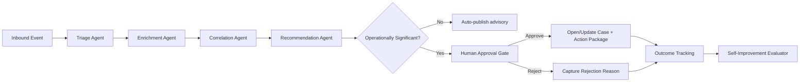

# ClearGlassInc Artemis — Self-Evolving AI Intelligence Platform Blueprint

> **Mission profile:** secure, coalition-aware, multi-domain intelligence platform that fuses data at machine speed, reasons with AI agents, and improves safely through audited, human-approved optimization loops.

## 1) System Architecture

### 1.1 Layered reference architecture (Palantir-native)

```text
┌──────────────────────────────────────────────────────────────────────────────┐
│ Frontend (Gotham/Foundry Apps + custom React mission UI)                    │
│ - Analyst Copilot UI  - Commander COP  - Case board  - Eval dashboards      │
└───────────────┬──────────────────────────────────────────────────────────────┘
                │
┌───────────────▼──────────────────────────────────────────────────────────────┐
│ API + Orchestration Layer                                                    │
│ - API Gateway (REST/GraphQL/gRPC)                                            │
│ - Mission Services (case mgmt, watchlists, recommendations)                  │
│ - AIP Agent Runtime (tool-calling, planner/executor, approvals)              │
│ - Policy Decision Point (OPA/Rego + Foundry policy context)                  │
└───────────────┬──────────────────────────────────────────────────────────────┘
                │
┌───────────────▼──────────────────────────────────────────────────────────────┐
│ Data + Ontology Layer (Foundry)                                              │
│ - Ontology objects/actions/functions                                          │
│ - Batch + streaming pipelines (live + historical)                             │
│ - Lineage, confidence, temporal state                                         │
│ - Feature/eval stores                                                         │
└───────────────┬──────────────────────────────────────────────────────────────┘
                │
┌───────────────▼──────────────────────────────────────────────────────────────┐
│ Intelligence AI Layer (AIP + model router)                                   │
│ - Copilots, triage agents, enrichment agents, recommendation agents           │
│ - Retrieval + memory + tool adapters                                          │
│ - Eval harness + shadow mode + A/B testing                                    │
└───────────────┬──────────────────────────────────────────────────────────────┘
                │
┌───────────────▼──────────────────────────────────────────────────────────────┐
│ Runtime + Deployment Control (Apollo)                                         │
│ - Progressive rollout, canary, rollback                                       │
│ - Signed artifacts, environment pinning, compliance enforcement               │
└──────────────────────────────────────────────────────────────────────────────┘
```

### 1.2 Component responsibilities

- **Gotham:** operational graph, entity resolution, investigations, link analysis, mission timeline.
- **Foundry:** ingestion, transformation, ontology, data products, application logic integration.
- **AIP:** copilots, multi-agent orchestration, tool execution, evaluations, workflow automation.
- **Apollo:** secure deployment, release channels, rollback, runtime controls across enclaves.

### 1.3 Deployment topology

- **Edge collectors:** SIGINT/OSINT/cyber telemetry collection gateways.
- **Regional processing cells:** low-latency stream processing and initial triage.
- **Core enclave:** model routing, cross-domain correlation, long-horizon learning/evals.
- **Cross-domain guard services:** sanitize + downgrade logic for coalition sharing.

---

## 2) Data and Ontology

### 2.1 Core ontology classes

```yaml
Entity:
  - Person
  - Organization
  - Device
  - Credential
  - IPAddress
  - Domain
  - FileArtifact
  - MalwareFamily
  - Mission
  - Alert
  - Case
  - ActionPackage

Relationship:
  - COMMUNICATES_WITH
  - LOGGED_IN_FROM
  - ASSOCIATED_WITH
  - INDICATES
  - PART_OF_MISSION
  - DERIVED_FROM
  - VERIFIED_BY
  - REJECTED_BY

ContextDimensions:
  - coalition_compartment
  - mission_priority
  - geotemporal_window
  - source_reliability
  - handling_caveat
```

### 2.2 Required attributes for all entities

| Field | Type | Purpose |
|---|---|---|
| `entity_id` | UUID | Global immutable identity |
| `entity_type` | ENUM | Ontology class |
| `confidence` | FLOAT(0..1) | Belief score from fusion engine |
| `valid_time` | tstzrange | Time interval when fact is true in world |
| `system_time` | tstzrange | Time interval when fact is stored in platform |
| `lineage_refs` | ARRAY<URI> | Data source + transformation provenance |
| `classification` | ENUM | Security marking |
| `compartments` | ARRAY<TEXT> | Need-to-know controls |
| `coalition_tags` | ARRAY<TEXT> | Releasability boundaries |

### 2.3 Ontology drives behavior

- **Human workflows:** case templates, SOP checklists, mission board filters, auto-populated action package fields.
- **Agent workflows:** tool availability, prompt context boundaries, routing policy, allowed action surface.
- **Policy controls:** row/column/object/action constraints resolved against ontology tags and user clearances.

### 2.4 SQL skeleton (lakehouse + graph projection)

```sql
create table ontology_entities (
  entity_id uuid primary key,
  entity_type text not null,
  canonical_name text,
  confidence numeric(5,4) not null check (confidence between 0 and 1),
  valid_time tstzrange not null,
  system_time tstzrange not null,
  classification text not null,
  compartments text[] not null,
  coalition_tags text[] not null,
  lineage_refs text[] not null,
  payload jsonb not null,
  created_at timestamptz not null default now()
);

create table ontology_relationships (
  rel_id uuid primary key,
  src_entity_id uuid not null references ontology_entities(entity_id),
  dst_entity_id uuid not null references ontology_entities(entity_id),
  rel_type text not null,
  confidence numeric(5,4) not null,
  evidence jsonb not null,
  valid_time tstzrange not null,
  system_time tstzrange not null,
  created_at timestamptz not null default now()
);

create table operator_feedback (
  feedback_id uuid primary key,
  case_id uuid not null,
  actor_id text not null,
  event_type text not null, -- accept/reject/edit/escalate
  original_artifact jsonb not null,
  corrected_artifact jsonb,
  rationale text,
  mission_outcome text,
  created_at timestamptz not null default now()
);
```

---

## 3) AI and Agent Design

### 3.1 Agent classes

1. **Analyst Copilot Agent**
   - Generates hypotheses, explains graph links, drafts intel products.
2. **Commander Copilot Agent**
   - Produces option trees, risk-weighted recommendations, force allocation deltas.
3. **Triage Agent**
   - Deduplicates, prioritizes, and assigns incoming alerts.
4. **Enrichment Agent**
   - Calls tools to retrieve external/internal context, computes confidence deltas.
5. **Correlation Agent**
   - Multi-hop graph correlation and campaign-level clustering.
6. **Action Package Agent**
   - Prepares operational packet; execution blocked until human approval gate passes.

### 3.2 Multi-agent workflow graph



### 3.3 Tooling contract for AIP agents

```json
{
  "tool_name": "query_ontology",
  "input_schema": {
    "type": "object",
    "properties": {
      "entity_type": {"type": "string"},
      "filters": {"type": "object"},
      "time_window": {"type": "string"},
      "max_rows": {"type": "integer", "minimum": 1, "maximum": 500}
    },
    "required": ["entity_type", "max_rows"]
  },
  "policy_requirements": [
    "purpose_binding",
    "mission_context_present",
    "clearance_check"
  ]
}
```

### 3.4 Model router policy

- **Fast path (sub-300ms):** distilled model for triage labeling.
- **Reasoning path:** larger model for correlation and recommendation synthesis.
- **High-assurance path:** policy-constrained chain with explicit citations and confidence decomposition.
- **Fallback path:** deterministic rules when model confidence < threshold.

---

## 4) Self-Improvement Loop (Human-Governed)

### 4.1 Signals collected

- Operator accepts/rejects.
- Manual edits of summaries/recommendations.
- Case outcomes (true positive/false positive/mission impact).
- Latency + tool failure traces.
- Prompt-route-model tuple metadata.

### 4.2 Improvement pipeline

1. **Ingest telemetry:** write immutable logs to eval store.
2. **Label generation:** convert feedback to supervised preference/eval labels.
3. **Candidate generation:** propose prompt/workflow/model routing updates.
4. **Offline eval:** precision/recall, calibration, latency, policy violations.
5. **Shadow deploy:** canary in Apollo with no operational effect.
6. **Human review board:** approve/reject promotion package.
7. **Progressive rollout:** 5% → 25% → 100% with auto-rollback triggers.

### 4.3 Guardrails against unsafe self-modification

- Agents may **propose** but cannot self-apply changes.
- All changes are versioned artifacts (`prompt_bundle`, `workflow_dag`, `routing_policy`).
- Mandatory two-person approval for operationally significant behavior changes.
- Rollback SLA: < 60 seconds via Apollo pinned previous release.

### 4.4 Drift detection

- Data drift: population stability index on key features.
- Concept drift: outcome degradation by mission slice.
- Behavior drift: policy-check failure rates and abnormal tool call patterns.

---

## 5) Full-Stack Implementation Blueprint

### 5.1 Frontend (TypeScript/React)

- **Mission Ops Console:** real-time alert stream, graph panel, recommendation queue.
- **Copilot Workbench:** grounded chat with citation panes + approval actions.
- **Eval Studio:** compare prompt/workflow versions and mission outcome deltas.

### 5.2 API Gateway

- Envoy/Kong with mTLS, JWT introspection, attribute-based access context injection.
- Endpoints:
  - `POST /events/intake`
  - `POST /copilot/query`
  - `POST /cases/{id}/approve-action`
  - `GET /evals/experiments/{id}`

### 5.3 Backend microservices (Python)

- `event-intake-svc`: validation, normalization, stream publish.
- `triage-svc`: rule+model prioritization.
- `agent-orchestrator-svc`: workflow state machine + tool mediation.
- `policy-svc`: OPA decision API + policy cache.
- `learning-svc`: eval pipelines + proposal generation.

### 5.4 Streaming/data platform

- Kafka/Pulsar topics:
  - `intel.raw.events`
  - `intel.enriched.events`
  - `intel.recommendations`
  - `intel.operator.feedback`
  - `intel.eval.labels`
- Foundry pipelines materialize ontology datasets + feature views.

### 5.5 Retrieval + search

- Hybrid retrieval:
  - keyword + BM25 over reports
  - vector retrieval over embeddings
  - graph neighborhood expansion via ontology links

### 5.6 Observability

- OpenTelemetry tracing across tool calls.
- RED metrics (rate/errors/duration) per agent.
- Eval dashboards: precision@k, recall, trust score, approval rate, mean time to decision.

---

## 6) Security and Governance

### 6.1 Access model

- **Need-to-know ABAC:** subject attributes (clearance, mission role, coalition) ∩ object labels.
- **Entity-level checks:** each ontology object filtered by compartment and releasability.
- **Action-level controls:** sensitive tools require explicit just-in-time policy permit.

### 6.2 Zero-trust enforcement

- mTLS between all services.
- SPIFFE/SPIRE identity for workload attestation.
- Signed model/prompt bundles and verified at runtime.

### 6.3 Immutable provenance

- Append-only audit ledger storing:
  - source artifact hashes
  - model/prompt/workflow version IDs
  - operator decisions
  - policy decision snapshots

### 6.4 Policy-as-code (Rego)

```rego
package artemis.authz

default allow = false

allow {
  input.subject.clearance_level >= input.resource.classification_level
  some c
  input.resource.compartments[c] == input.subject.compartments[_]
  input.subject.coalition in input.resource.releasable_to
  input.action in {"read", "summarize", "recommend"}
}

allow {
  input.action == "execute_operational_package"
  input.context.human_approved == true
  input.context.two_person_rule == true
}
```

---

## 7) Code Examples

### 7.1 Event intake service (Python / FastAPI)

```python
from fastapi import FastAPI, Depends, HTTPException
from pydantic import BaseModel, Field
from uuid import uuid4
from datetime import datetime, timezone

app = FastAPI(title="ClearGlassInc Artemis Event Intake")

class IntelEvent(BaseModel):
    source: str
    event_type: str
    payload: dict
    classification: str
    mission_id: str

async def authorize(event: IntelEvent, subject: dict):
    # call policy-svc / OPA
    allowed = subject["clearance"] in {"SECRET", "TOP_SECRET"}
    if not allowed:
        raise HTTPException(status_code=403, detail="policy denied")

@app.post("/events/intake")
async def intake(event: IntelEvent, subject: dict = Depends(lambda: {"clearance": "TOP_SECRET"})):
    await authorize(event, subject)
    normalized = {
        "event_id": str(uuid4()),
        "source": event.source,
        "event_type": event.event_type,
        "payload": event.payload,
        "classification": event.classification,
        "mission_id": event.mission_id,
        "ingested_at": datetime.now(timezone.utc).isoformat()
    }
    # publish to intel.raw.events topic
    return {"status": "accepted", "event": normalized}
```

### 7.2 Agent workflow state machine (Python)

```python
from enum import Enum

class State(str, Enum):
    TRIAGE = "triage"
    ENRICH = "enrich"
    CORRELATE = "correlate"
    RECOMMEND = "recommend"
    WAIT_APPROVAL = "wait_approval"
    COMPLETE = "complete"

class MissionWorkflow:
    def __init__(self, tools, policy):
        self.tools = tools
        self.policy = policy

    async def run(self, event):
        triaged = await self.tools.triage(event)
        enriched = await self.tools.enrich(triaged)
        correlated = await self.tools.correlate(enriched)
        rec = await self.tools.recommend(correlated)

        if rec["operational_significance"]:
            if not await self.policy.require_human_approval(rec):
                return {"state": State.WAIT_APPROVAL, "recommendation": rec}

        result = await self.tools.open_or_update_case(rec)
        return {"state": State.COMPLETE, "result": result}
```

### 7.3 Ontology-driven query (SQL + Python)

```sql
-- Find high-confidence entities connected to a suspicious domain in last 72h
select e.entity_id,
       e.entity_type,
       e.payload,
       r.rel_type,
       r.confidence
from ontology_entities e
join ontology_relationships r on r.dst_entity_id = e.entity_id
join ontology_entities d on d.entity_id = r.src_entity_id
where d.entity_type = 'Domain'
  and d.canonical_name = :domain
  and upper(r.valid_time) > now() - interval '72 hours'
  and r.confidence >= 0.80
order by r.confidence desc
limit 200;
```

```python
async def query_suspicious_neighbors(db, domain: str, user_ctx: dict):
    await enforce_abac("read", resource_type="ontology_entity", user_ctx=user_ctx)
    return await db.fetch_all(SQL_NEIGHBORS, values={"domain": domain})
```

### 7.4 Prompt and routing evaluator (Python)

```python
from dataclasses import dataclass

@dataclass
class Candidate:
    prompt_version: str
    workflow_version: str
    model_route: str

@dataclass
class EvalResult:
    precision: float
    recall: float
    latency_ms: int
    policy_violations: int


def score(result: EvalResult) -> float:
    return (
        0.35 * result.precision
        + 0.25 * result.recall
        - 0.20 * (result.latency_ms / 1000)
        - 0.20 * result.policy_violations
    )


def promote_if_safe(champion: EvalResult, challenger: EvalResult) -> bool:
    if challenger.policy_violations > 0:
        return False
    if challenger.precision < champion.precision - 0.01:
        return False
    return score(challenger) > score(champion)
```

### 7.5 Frontend approval control (TypeScript)

```ts
export async function approveActionPackage(caseId: string, packageId: string, justification: string) {
  const res = await fetch(`/api/cases/${caseId}/approve-action`, {
    method: "POST",
    headers: { "Content-Type": "application/json" },
    body: JSON.stringify({ packageId, justification })
  });

  if (!res.ok) throw new Error(`Approval failed: ${res.status}`);
  return res.json();
}
```

### 7.6 AIP tool call contract (C# + PowerShell fragments)

```csharp
public record ToolRequest(string ToolName, Dictionary<string, object> Args, string MissionId, string Purpose);
public record ToolResponse(bool Allowed, string DecisionId, object Data, string[] Citations);

public interface IPolicyGuard {
    Task<ToolResponse> ExecuteWithPolicyAsync(ToolRequest req, ClaimsPrincipal user);
}
```

```powershell
function Invoke-ArtemisPolicyCheck {
  param(
    [string]$Action,
    [string]$MissionId,
    [hashtable]$Context
  )

  $body = @{ action = $Action; missionId = $MissionId; context = $Context } | ConvertTo-Json -Depth 6
  Invoke-RestMethod -Uri "$env:POLICY_SVC_URL/decide" -Method Post -Body $body -ContentType "application/json"
}
```

---

## 8) Scenario Walkthrough (Cinematic but operationally credible)

### T+00:00 — Live event enters platform
A new endpoint detection alert arrives: anomalous PowerShell beaconing from a privileged workstation. `event-intake-svc` validates schema/classification and publishes to `intel.raw.events`.

### T+00:02 — Triage and enrichment
Triage Agent scores as priority **P1** due to privileged asset + known C2 pattern match. Enrichment Agent pulls:
- host history
- user session anomalies
- linked domains/IPs
- prior mission context

### T+00:05 — Correlation and recommendation
Correlation Agent identifies overlap with active campaign cluster in Gotham graph. Recommendation Agent proposes:
1. isolate host
2. disable credential
3. open coalition notification draft (sanitized)

The recommendation is marked **operationally significant**, triggering approval gate.

### T+00:06 — Human decision
Analyst accepts 1 and 2, rejects 3 with rationale: insufficient confidence for coalition dissemination.

### T+00:07 — Execution + audit
Approved actions execute through case management integration. Audit ledger stores:
- recommendation version IDs
- policy decision IDs
- operator decision + rationale
- resulting containment metrics

### T+30:00 — Outcome-driven learning
Incident resolved. Post-incident label indicates coalition draft was a false positive recommendation.

`learning-svc` produces proposal:
- lower coalition-notification trigger unless confidence > 0.92 and corroborated by ≥2 independent sources.
- update prompt to require explicit source diversity check.

Proposal enters eval pipeline, passes offline metrics, then shadow mode. Human review board approves. Apollo rolls out to 5% canary, then fleet-wide after no regressions.

Result: **system gets better** (fewer premature coalition notifications) while preserving strict human governance and rollback safety.

---

## 9) Banner Prompt (for GitHub repository hero image)

```text
Create an 8K ultra-wide cinematic GitHub repository banner for ClearGlassInc Artemis, themed “Cybernetic Security & Neural Systems.” Use a deep obsidian background with neon cyan and amber accent lighting. Center a complex translucent 3D orbital data grid with floating digital signal overlays, holographic threat vectors, and subtle code fragments rendered in C# and PowerShell syntax. Visual style should feel like a premium SOC command dashboard: minimalist, high-contrast, ray-traced reflections, volumetric haze, clean negative space for title text, and professional mission-critical tone.
```
