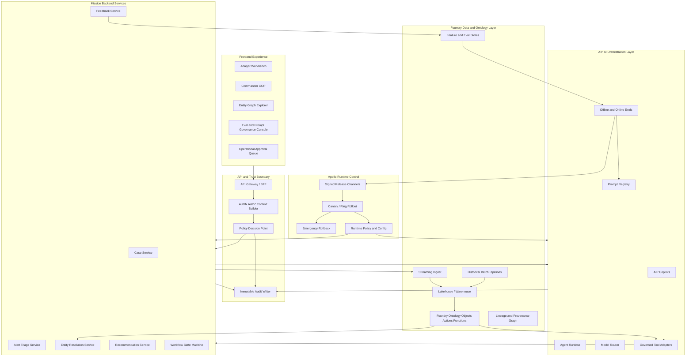
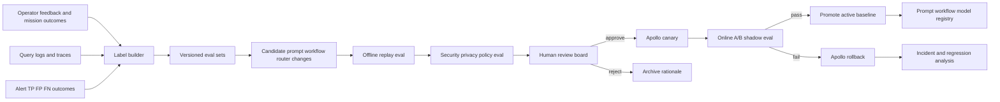

# ClearGlassInc Artemis — Production Self-Evolving AI Intelligence Platform

## System Architecture

ClearGlassInc Artemis is a secure, coalition-aware, multi-domain intelligence platform built around Palantir Gotham, Foundry, AIP, and Apollo. Gotham provides operational intelligence workflows, investigations, entity tracking, link analysis, and case management. Foundry provides the data integration fabric, ontology, pipelines, lineage, and application logic. AIP provides governed copilots, agents, tool execution, evaluations, prompt management, and workflow automation. Apollo provides secure deployment, runtime control, progressive rollout, rollback, and environment-specific release governance.



### Full-stack layers

| Layer | Production responsibility | Palantir role |
|---|---|---|
| Frontend | Mission command UI, analyst workflows, graph exploration, review queues, eval dashboards | Gotham operational UI plus Foundry/AIP applications |
| API gateway | mTLS, JWT validation, request shaping, rate limiting, mission context injection | Front door for Foundry applications and custom services |
| Backend services | Case orchestration, triage, enrichment, recommendations, feedback capture | Foundry-backed application services |
| Event bus | Low-latency ingestion, replay, fan-out, exactly-once-ish processing with idempotency | Foundry streaming pipelines and external Kafka/Pub/Sub |
| Data lakehouse | Historical records, normalized observations, curated facts, feature tables | Foundry datasets, transforms, lineage, schedules |
| Ontology | Operational objects, actions, permissions, temporal state, relationships | Foundry Ontology as the semantic control plane |
| AI orchestration | Copilots, agents, model routing, tool use, evaluations, prompt governance | AIP runtime, AIP Logic, AIP evaluations |
| Policy | Need-to-know, compartment, coalition, action authorization | Foundry security model plus OPA-style policy-as-code |
| Observability | Logs, metrics, traces, eval telemetry, model drift signals | Foundry operational metadata plus SIEM/APM exports |
| Deployment | Signed releases, staged rollout, rollback, version pinning | Apollo release and runtime control |

### Runtime topology

```text
apps/
  web/
    src/app/(mission)/dashboard.tsx
    src/app/(mission)/case/[caseId]/page.tsx
    src/app/(governance)/evals/page.tsx
  gateway/
    policy_context.ts
    rate_limits.ts
  services/
    alert_triage/
    entity_resolution/
    recommendation/
    feedback/
    workflow/
  ai/
    agents/
    tools/
    prompts/
    evals/
    routing/
  data/
    foundry_transforms/
    ontology/
    sql/
  deploy/
    apollo/
    k8s/
    terraform/
```

ClearGlassInc Artemis runs in deployment cells: edge collection cells for low-latency ingress, regional processing cells for stream triage and enrichment, core analysis enclaves for deep correlation and eval generation, and coalition release cells that enforce cross-domain sanitization and releasability rules.

## Data and Ontology

The ontology is the operational contract between humans, AI agents, data pipelines, and policy enforcement. Every object has lineage, confidence, temporal validity, classification, mission context, and permission metadata. Agents do not query raw data freely; they operate through ontology actions and governed retrieval tools that inherit these controls.

### Core ontology entities

```yaml
Ontology:
  Person:
    keys: [person_id, aliases, biometrics_refs]
    required: [confidence, classification, compartments, lineage_refs, valid_time]
  Organization:
    keys: [org_id, names, registration_refs]
  Location:
    keys: [location_id, geohash, administrative_area]
  Device:
    keys: [device_id, imei_hash, mac_hash, serial_hash]
  NetworkAsset:
    keys: [asset_id, ip, domain, certificate_fingerprint]
  Vehicle:
    keys: [vehicle_id, plate_hash, vin_hash, sensor_tracks]
  Observation:
    keys: [observation_id, source_id, observed_at, extracted_facts]
  Alert:
    keys: [alert_id, severity, triage_status, linked_observations]
  Case:
    keys: [case_id, mission_id, status, assigned_cell]
  Mission:
    keys: [mission_id, objectives, constraints, authority]
  ActionPackage:
    keys: [package_id, case_id, recommended_action, approval_state]
  IntelProduct:
    keys: [product_id, case_id, summary, citations, dissemination_controls]
  PromptVersion:
    keys: [prompt_id, semantic_version, hash, approval_status]
  WorkflowVersion:
    keys: [workflow_id, semantic_version, state_machine_hash]
  ModelRoute:
    keys: [route_id, model_family, risk_tier, eval_score]
```

### Relationships

```yaml
Relationships:
  OBSERVED_AT: [Observation, Location]
  OBSERVED_ENTITY: [Observation, Entity]
  COMMUNICATES_WITH: [Person|Device|NetworkAsset, Person|Device|NetworkAsset]
  ASSOCIATED_WITH: [Entity, Entity]
  INDICATES: [Observation, Alert]
  DERIVED_FROM: [Entity|Alert|IntelProduct, Observation|Dataset|PromptVersion]
  PART_OF_MISSION: [Case|Alert|ActionPackage, Mission]
  RECOMMENDS: [AgentRun, ActionPackage]
  APPROVED_BY: [ActionPackage|PromptVersion|WorkflowVersion, Operator]
  REJECTED_BY: [ActionPackage|PromptVersion|WorkflowVersion, Operator]
  SUPERSEDES: [PromptVersion|WorkflowVersion|ModelRoute, PromptVersion|WorkflowVersion|ModelRoute]
```

### SQL data model

```sql
create table ontology_entity (
  entity_id uuid primary key,
  entity_type text not null,
  canonical_name text,
  confidence numeric(5,4) not null check (confidence between 0 and 1),
  valid_start timestamptz not null,
  valid_end timestamptz,
  system_start timestamptz not null default now(),
  system_end timestamptz,
  classification text not null,
  compartments text[] not null default '{}',
  coalition_tags text[] not null default '{}',
  mission_ids uuid[] not null default '{}',
  lineage_refs text[] not null,
  source_reliability text not null,
  information_credibility text not null,
  payload jsonb not null default '{}'
);

create table ontology_relationship (
  relationship_id uuid primary key,
  src_entity_id uuid not null references ontology_entity(entity_id),
  dst_entity_id uuid not null references ontology_entity(entity_id),
  relationship_type text not null,
  confidence numeric(5,4) not null check (confidence between 0 and 1),
  valid_start timestamptz not null,
  valid_end timestamptz,
  system_start timestamptz not null default now(),
  system_end timestamptz,
  classification text not null,
  compartments text[] not null default '{}',
  coalition_tags text[] not null default '{}',
  mission_context_id uuid,
  evidence jsonb not null,
  lineage_refs text[] not null
);

create table operator_feedback (
  feedback_id uuid primary key,
  case_id uuid not null,
  mission_id uuid not null,
  actor_id text not null,
  event_type text not null check (event_type in ('accept','reject','edit','escalate','missed_alert','false_positive')),
  original_artifact jsonb not null,
  corrected_artifact jsonb,
  rationale text,
  outcome_label text,
  classification text not null,
  compartments text[] not null default '{}',
  created_at timestamptz not null default now()
);

create table ai_artifact_version (
  artifact_id uuid primary key,
  artifact_type text not null check (artifact_type in ('prompt','workflow','router','heuristic','eval_set')),
  name text not null,
  semantic_version text not null,
  content_hash text not null,
  content_uri text not null,
  parent_artifact_id uuid,
  status text not null check (status in ('draft','offline_eval','review','canary','active','rolled_back','retired')),
  created_by text not null,
  approved_by text,
  approved_at timestamptz,
  audit_ref text not null,
  unique (artifact_type, name, semantic_version)
);
```

### Ontology-driven behavior

1. **Human workflow generation:** case screens, required fields, watchlists, SOP checklists, and action package templates are generated from ontology object type and mission context.
2. **AI context construction:** retrieval tools filter by object permissions, temporal window, mission ID, lineage quality, and confidence threshold before any prompt is assembled.
3. **Action safety:** ontology actions declare side effects, approval gate, allowed roles, required citations, and rollback semantics.
4. **Coalition sharing:** releasability tags determine what fields can be rendered, summarized, exported, or used as model context.

## AI and Agent Design

### Copilots

- **Analyst Copilot:** answers grounded questions, builds link-analysis hypotheses, drafts intelligence notes, summarizes evidence, proposes collection gaps, and explains confidence.
- **Commander Copilot:** provides mission-level common operating picture summaries, courses of action, risk matrices, resource tradeoffs, and escalation options.
- **Data Steward Copilot:** flags lineage anomalies, schema drift, duplicate entities, low-confidence merges, and policy-tagging gaps.
- **Governance Copilot:** helps reviewers compare prompt/workflow versions, inspect eval failures, and approve or reject proposed self-upgrades.

### Multi-agent workflows

```yaml
workflow: live_intel_triage_to_action
risk_tier: mission_significant
states:
  - ingress_normalization
  - policy_precheck
  - triage
  - enrichment
  - correlation
  - hypothesis_generation
  - recommendation
  - red_team_review
  - human_approval
  - action_package_preparation
  - dissemination
  - outcome_capture
approval_gates:
  advisory_summary: G1_analyst_ack
  case_open: G2_named_approver
  action_package: G3_two_person_integrity
  external_dissemination: G3_release_authority
```

Agent roles are intentionally narrow. The triage agent scores urgency and quality; the enrichment agent retrieves related entities and evidence; the correlation agent searches for temporal and graph patterns; the recommendation agent proposes options; the red-team agent critiques assumptions and missing evidence; the execution agent can only prepare gated action packages, never execute operationally significant actions without approval.

### Tool contract

```python
from __future__ import annotations

from enum import Enum
from pydantic import BaseModel, Field
from typing import Any


class Decision(str, Enum):
    ALLOW = "allow"
    DENY = "deny"
    ESCALATE = "escalate"


class ToolRisk(str, Enum):
    READ_ONLY = "G0"
    ADVISORY = "G1"
    CASE_MUTATION = "G2"
    MISSION_SIGNIFICANT = "G3"


class MissionContext(BaseModel):
    mission_id: str
    user_id: str
    roles: list[str]
    clearance: str
    compartments: list[str]
    coalition_tags: list[str]
    purpose: str
    trace_id: str


class ToolCall(BaseModel):
    name: str
    risk: ToolRisk
    payload: dict[str, Any]
    context: MissionContext
    idempotency_key: str


class ToolResult(BaseModel):
    ok: bool
    decision: Decision
    data: dict[str, Any] = Field(default_factory=dict)
    audit_ref: str
    reason: str | None = None
```

## Self-Improvement Loop

ClearGlassInc Artemis improves through a controlled evidence-to-change pipeline. The platform can propose new prompts, workflow transitions, heuristic thresholds, retrieval policies, and model-routing rules, but cannot promote them without explicit human approval and passing predefined evaluations.



### Improvement signals

- Operator edits to generated summaries and action packages.
- Accept, reject, escalation, and override decisions.
- False positives, false negatives, true positives, and stale alerts.
- Time-to-triage, time-to-decision, and analyst dwell time.
- Retrieval hit quality, citation coverage, source diversity, and contradiction rate.
- Model route latency, cost, context length, refusal rate, and safety-policy interventions.
- Mission outcome labels and post-operation review findings.

### Safe upgrade controls

| Control | Requirement |
|---|---|
| Versioning | Every prompt, workflow, heuristic, eval set, and route has a semantic version and content hash |
| Offline replay | Candidate changes replay against frozen historical cases and red-team adversarial cases |
| Promotion threshold | Candidate must beat baseline on precision, recall, calibration, latency, safety, and citation coverage |
| Human approval | Named reviewers approve with rationale before canary |
| Canary | Apollo releases to a small mission-safe cohort or shadow-only mode first |
| Rollback | Automated rollback triggers on SLO regression, policy violation, drift, or operator trust drop |
| Auditability | Every proposal, score, approval, deployment, and rollback is immutable and searchable |

### Drift detection

```python
from dataclasses import dataclass

@dataclass(frozen=True)
class DriftSignal:
    metric: str
    baseline: float
    current: float
    threshold: float

    def breached(self) -> bool:
        return abs(self.current - self.baseline) >= self.threshold


def detect_drift(signals: list[DriftSignal]) -> list[DriftSignal]:
    return [signal for signal in signals if signal.breached()]
```

## Full-Stack Implementation

### Web UI

The web application exposes mission dashboards, case review, approval queues, explainability panels, and governance consoles. The UI treats AI output as a cited, reviewable artifact rather than an authority.

```tsx
// apps/web/src/components/RecommendationCard.tsx
import type { Recommendation } from "../types";

export function RecommendationCard({ item, onApprove, onReject }: {
  item: Recommendation;
  onApprove: (id: string) => void;
  onReject: (id: string, rationale: string) => void;
}) {
  return (
    <section className="rounded-xl border border-slate-700 bg-slate-950 p-4">
      <div className="flex items-center justify-between">
        <h3 className="text-lg font-semibold">{item.title}</h3>
        <span className="text-sm">Confidence {(item.confidence * 100).toFixed(1)}%</span>
      </div>
      <p className="mt-2 text-slate-300">{item.summary}</p>
      <ul className="mt-3 list-disc pl-6 text-sm text-slate-400">
        {item.citations.map((citation) => <li key={citation.uri}>{citation.label}</li>)}
      </ul>
      <div className="mt-4 flex gap-2">
        <button onClick={() => onApprove(item.id)}>Approve</button>
        <button onClick={() => onReject(item.id, "Insufficient evidence")}>Reject</button>
      </div>
    </section>
  );
}
```

### API gateway and policy enforcement

```python
# apps/gateway/policy_context.py
from pydantic import BaseModel

class RequestContext(BaseModel):
    user_id: str
    roles: list[str]
    clearance: str
    compartments: list[str]
    coalition_tags: list[str]
    mission_id: str
    purpose: str
    trace_id: str


def build_policy_input(ctx: RequestContext, action: str, resource: dict) -> dict:
    return {
        "subject": ctx.model_dump(),
        "action": action,
        "resource": resource,
        "environment": {"service": "clearglassinc-artemis", "trace_id": ctx.trace_id},
    }
```

```rego
package artemis.authz

default allow := false

default escalate := false

allow if {
  input.subject.clearance == input.resource.classification
  every c in input.resource.compartments { c in input.subject.compartments }
  every tag in input.resource.coalition_tags { tag in input.subject.coalition_tags }
  input.subject.mission_id in input.resource.mission_ids
}

escalate if {
  input.action == "prepare_action_package"
  input.resource.risk_tier == "G3"
}
```

### Backend service skeleton

```python
# services/recommendation/main.py
from fastapi import FastAPI, HTTPException
from pydantic import BaseModel

app = FastAPI(title="ClearGlassInc Artemis Recommendation Service")

class RecommendationRequest(BaseModel):
    case_id: str
    mission_id: str
    trace_id: str
    max_options: int = 3

class RecommendationOption(BaseModel):
    title: str
    summary: str
    confidence: float
    evidence_refs: list[str]
    required_gate: str

@app.post("/recommendations", response_model=list[RecommendationOption])
async def create_recommendations(req: RecommendationRequest) -> list[RecommendationOption]:
    case = await load_case_with_policy_filters(req.case_id, req.mission_id, req.trace_id)
    if not case:
        raise HTTPException(status_code=404, detail="case not found or not authorized")

    evidence = await retrieve_grounded_evidence(case)
    options = await run_recommendation_agent(case=case, evidence=evidence, trace_id=req.trace_id)
    return [option for option in options if option.confidence >= 0.55][: req.max_options]
```

### Streaming event handler

```python
# services/alert_triage/handler.py
import json
from pydantic import BaseModel, Field

class ObservationEvent(BaseModel):
    observation_id: str
    source_id: str
    observed_at: str
    classification: str
    compartments: list[str] = Field(default_factory=list)
    coalition_tags: list[str] = Field(default_factory=list)
    payload: dict
    trace_id: str

async def handle_observation(raw: bytes) -> None:
    event = ObservationEvent.model_validate(json.loads(raw))
    normalized = await normalize_observation(event)
    entity_refs = await resolve_entities(normalized)
    alert = await score_alert(normalized, entity_refs)

    await write_lineage(
        trace_id=event.trace_id,
        source_ref=event.observation_id,
        outputs=[alert.alert_id, *entity_refs],
        transform="alert_triage.v1",
    )

    if alert.score >= 0.80:
        await publish("intel.alert.high", alert.model_dump_json().encode())
    else:
        await publish("intel.alert.review", alert.model_dump_json().encode())
```

### Ontology-driven query

```python
# ai/tools/query_ontology.py
async def query_related_entities(db, ctx, entity_id: str, window_start: str, window_end: str):
    sql = """
    select r.relationship_id, r.relationship_type, r.confidence,
           e.entity_id, e.entity_type, e.canonical_name, e.lineage_refs
    from ontology_relationship r
    join ontology_entity e on e.entity_id = r.dst_entity_id
    where r.src_entity_id = :entity_id
      and r.valid_start <= :window_end
      and coalesce(r.valid_end, 'infinity') >= :window_start
      and :mission_id = any(e.mission_ids)
      and e.classification = :clearance
      and e.compartments <@ :compartments
      and e.coalition_tags <@ :coalition_tags
    order by r.confidence desc
    limit 100
    """
    return await db.fetch_all(sql, {
        "entity_id": entity_id,
        "window_start": window_start,
        "window_end": window_end,
        "mission_id": ctx.mission_id,
        "clearance": ctx.clearance,
        "compartments": ctx.compartments,
        "coalition_tags": ctx.coalition_tags,
    })
```

### Workflow state machine

```python
# services/workflow/state_machine.py
from enum import Enum
from pydantic import BaseModel

class State(str, Enum):
    TRIAGED = "triaged"
    ENRICHED = "enriched"
    CORRELATED = "correlated"
    RECOMMENDED = "recommended"
    PENDING_APPROVAL = "pending_approval"
    APPROVED = "approved"
    REJECTED = "rejected"
    CLOSED = "closed"

class Transition(BaseModel):
    from_state: State
    to_state: State
    actor_id: str
    rationale: str
    trace_id: str

ALLOWED = {
    State.TRIAGED: {State.ENRICHED},
    State.ENRICHED: {State.CORRELATED},
    State.CORRELATED: {State.RECOMMENDED},
    State.RECOMMENDED: {State.PENDING_APPROVAL},
    State.PENDING_APPROVAL: {State.APPROVED, State.REJECTED},
    State.APPROVED: {State.CLOSED},
    State.REJECTED: {State.CLOSED},
}

def validate_transition(current: State, requested: State) -> None:
    if requested not in ALLOWED.get(current, set()):
        raise ValueError(f"invalid workflow transition: {current} -> {requested}")
```

### AIP-style tool execution guard

```python
# ai/tools/runner.py
async def execute_tool(call: ToolCall) -> ToolResult:
    policy = await evaluate_policy(call.context, action=call.name, resource=call.payload)
    audit_ref = await audit_tool_attempt(call, policy)

    if policy.decision == Decision.DENY:
        return ToolResult(ok=False, decision=Decision.DENY, audit_ref=audit_ref, reason=policy.reason)

    if policy.decision == Decision.ESCALATE or call.risk in {ToolRisk.CASE_MUTATION, ToolRisk.MISSION_SIGNIFICANT}:
        approval_id = await create_approval_request(call, audit_ref)
        return ToolResult(
            ok=False,
            decision=Decision.ESCALATE,
            audit_ref=audit_ref,
            data={"approval_id": approval_id},
            reason="human approval required",
        )

    result = await TOOL_REGISTRY[call.name](call.payload, call.context)
    await audit_tool_success(call, result, audit_ref)
    return ToolResult(ok=True, decision=Decision.ALLOW, data=result, audit_ref=audit_ref)
```

### Eval pipeline

```python
# ai/evals/prompt_candidate_eval.py
from pydantic import BaseModel

class EvalCase(BaseModel):
    case_id: str
    input_context_uri: str
    expected_labels: dict[str, float | str | bool]
    red_team_tags: list[str]

class EvalScore(BaseModel):
    precision: float
    recall: float
    groundedness: float
    citation_coverage: float
    policy_violations: int
    p95_latency_ms: int


def passes_promotion(score: EvalScore, baseline: EvalScore) -> bool:
    return (
        score.policy_violations == 0
        and score.precision >= baseline.precision + 0.02
        and score.recall >= baseline.recall - 0.01
        and score.groundedness >= 0.95
        and score.citation_coverage >= 0.98
        and score.p95_latency_ms <= int(baseline.p95_latency_ms * 1.10)
    )

async def evaluate_candidate(candidate_uri: str, cases: list[EvalCase], baseline: EvalScore) -> bool:
    score = await replay_cases(candidate_uri=candidate_uri, cases=cases)
    await persist_eval_result(candidate_uri, score)
    return passes_promotion(score, baseline)
```

### Apollo rollout manifest

```yaml
application: clearglassinc-artemis-ai-orchestrator
artifact: aip-workflow-bundle
version: 2.4.0
release_channel: mission-canary
strategy:
  type: progressive
  rings:
    - name: shadow
      traffic_percent: 0
      duration: 24h
    - name: canary
      traffic_percent: 5
      duration: 12h
    - name: regional
      traffic_percent: 25
      duration: 24h
    - name: global
      traffic_percent: 100
rollback:
  automatic: true
  triggers:
    - metric: policy_violations
      op: ">"
      value: 0
    - metric: groundedness
      op: "<"
      value: 0.95
    - metric: p95_latency_ms
      op: ">"
      value: 1800
    - metric: operator_rejection_rate
      op: ">"
      value: 0.35
approvals:
  required:
    - role: mission_ai_governance_lead
    - role: security_authorizing_official
```

## Security and Governance

### Access-control model

ClearGlassInc Artemis uses deny-by-default authorization at every trust boundary. Requests carry a signed mission context containing subject identity, roles, clearance, compartments, coalition releasability, mission assignment, purpose, device posture, and trace ID. Policy is enforced at UI rendering, API authorization, ontology queries, tool execution, export, and AI context assembly.

```yaml
security_controls:
  authentication:
    - phishing_resistant_mfa
    - workload_identity
    - mutual_tls
  authorization:
    - row_level_security
    - column_level_redaction
    - entity_level_permissions
    - ontology_action_policies
    - purpose_based_access
  compartmentalization:
    - mission_cells
    - coalition_tags
    - releasability_guards
    - cross_domain_sanitization
  zero_trust_runtime:
    - signed_artifacts
    - least_privilege_service_accounts
    - egress_allowlists
    - short_lived_credentials
    - confidential_runtime_where_required
  audit:
    - immutable_append_only_logs
    - prompt_and_model_version_traceability
    - tool_call_records
    - approval_decision_records
    - lineage_to_source_observations
```

### Model and prompt governance

- Prompts are treated as code: versioned, hashed, reviewed, tested, and deployed through Apollo-controlled release channels.
- Model routes are risk-tiered. High-risk workflows prefer models with stronger groundedness, evaluation history, and deployment approvals over raw speed.
- Training or fine-tuning datasets exclude unauthorized compartments and are built from explicitly approved feedback artifacts.
- Generated intelligence products require citations, classification markings, dissemination controls, and confidence statements.
- Agents cannot alter their own goals, approval gates, security policy, or deployment channels.

### Audit event schema

```json
{
  "event_type": "ai.tool_call",
  "trace_id": "trc_01J...",
  "actor_id": "operator-1842",
  "mission_id": "6a9f3a2d-3a0a-4d1c-9a5f-7df8c56e0b42",
  "tool": "prepare_action_package",
  "risk_tier": "G3",
  "policy_decision": "escalate",
  "prompt_hash": "sha256:...",
  "model_route": "reasoning-high-grounded-v7",
  "input_lineage_refs": ["foundry://dataset/observations/run/9831"],
  "output_artifact_ref": "foundry://object/action_package/123",
  "created_at": "2026-07-20T12:00:00Z"
}
```

## Code Examples

### Model router

```python
# ai/routing/model_router.py
from dataclasses import dataclass

@dataclass(frozen=True)
class RouteRequest:
    task: str
    risk_tier: str
    max_latency_ms: int
    requires_long_context: bool
    requires_strict_grounding: bool

@dataclass(frozen=True)
class ModelRoute:
    name: str
    model: str
    p95_latency_ms: int
    groundedness_score: float
    approved_risk_tiers: set[str]


def choose_route(req: RouteRequest, routes: list[ModelRoute]) -> ModelRoute:
    candidates = [
        route for route in routes
        if req.risk_tier in route.approved_risk_tiers
        and route.p95_latency_ms <= req.max_latency_ms
        and (not req.requires_strict_grounding or route.groundedness_score >= 0.95)
    ]
    if not candidates:
        raise RuntimeError("no approved model route satisfies policy and latency constraints")
    return sorted(candidates, key=lambda r: (-r.groundedness_score, r.p95_latency_ms))[0]
```

### Feedback-to-eval builder

```python
# ai/evals/build_eval_set.py
async def build_eval_cases(feedback_rows: list[dict]) -> list[EvalCase]:
    cases: list[EvalCase] = []
    for row in feedback_rows:
        if row["event_type"] not in {"reject", "edit", "missed_alert", "false_positive"}:
            continue
        context_uri = await freeze_case_context(row["case_id"], row["created_at"])
        expected = derive_expected_labels(row)
        cases.append(EvalCase(
            case_id=row["case_id"],
            input_context_uri=context_uri,
            expected_labels=expected,
            red_team_tags=infer_red_team_tags(row),
        ))
    return cases
```

### Prompt proposal record

```python
# ai/prompts/proposals.py
import hashlib
from pydantic import BaseModel

class PromptProposal(BaseModel):
    name: str
    parent_version: str
    proposed_version: str
    body: str
    reason: str
    eval_set_uri: str
    author: str = "artemis-improvement-agent"

    @property
    def content_hash(self) -> str:
        return "sha256:" + hashlib.sha256(self.body.encode("utf-8")).hexdigest()

async def submit_prompt_proposal(proposal: PromptProposal) -> str:
    artifact_id = await persist_artifact_version(
        artifact_type="prompt",
        name=proposal.name,
        semantic_version=proposal.proposed_version,
        content_hash=proposal.content_hash,
        content=proposal.body,
        status="offline_eval",
        created_by=proposal.author,
    )
    await create_review_task(
        artifact_id=artifact_id,
        reason=proposal.reason,
        required_roles=["mission_ai_governance_lead", "security_authorizing_official"],
    )
    return artifact_id
```

### Retrieval guardrail

```python
# ai/context/context_builder.py
async def build_grounded_context(query: str, ctx: MissionContext, top_k: int = 12) -> list[dict]:
    candidates = await hybrid_search(query=query, mission_id=ctx.mission_id, top_k=top_k * 4)
    authorized = []
    for item in candidates:
        decision = await evaluate_policy(ctx, "read", item.security_resource)
        if decision.decision == Decision.ALLOW and item.confidence >= 0.50:
            authorized.append({
                "text": redact_fields(item.text, ctx),
                "citation": item.lineage_ref,
                "confidence": item.confidence,
                "valid_time": item.valid_time,
            })
        if len(authorized) >= top_k:
            break
    return authorized
```

## Scenario Walkthrough

At 03:17 UTC, a live observation enters ClearGlassInc Artemis from a regional collection cell. The event is tagged with source reliability, classification, coalition releasability, sensor lineage, and a mission ID before it is accepted into the streaming ingest layer. Foundry streaming pipelines normalize the event, attach lineage, and project candidate objects into the ontology.

The alert triage service receives the normalized observation and resolves two entities: a network asset and a device previously associated with a dormant case. The triage agent assigns high urgency because the temporal pattern matches a known pre-incident sequence. The enrichment agent retrieves related observations, but only those authorized for the operator mission context. The correlation agent finds a weak but time-relevant relationship to an existing case and cites the exact observations and relationship edges.

The recommendation agent proposes three options: monitor, open a linked case, or prepare an action package. Because preparing an action package is mission-significant, the tool runner returns `ESCALATE` and creates a G3 two-person approval request instead of executing. The red-team review agent highlights uncertainty: the relationship confidence is 0.62, one source has medium reliability, and the pattern has a historical false-positive cluster. The UI displays the recommendation, confidence, caveats, citations, and approval controls.

An analyst rejects the immediate action package and approves a narrower case expansion. The operator adds rationale: "insufficient confidence for action; continue enrichment and prioritize HUMINT corroboration." The feedback service records the rejection, correction, mission context, and outcome label in `operator_feedback`. That feedback is later converted into an eval case that tests whether future recommendations should downgrade similar evidence patterns from G3 action-package recommendation to G2 case expansion.

Overnight, the improvement agent proposes a routing and prompt update: require an additional corroboration source before recommending mission-significant action for this pattern. The candidate runs through offline replay against frozen historical cases, adversarial red-team examples, and policy evals. It improves precision by 4.1%, keeps recall within tolerance, preserves citation coverage above 98%, and records zero policy violations. A governance reviewer approves the change with a security authorizing official. Apollo deploys it in shadow mode, then a 5% canary. If rejection rate, latency, groundedness, or policy metrics regress, Apollo automatically rolls back to the prior route and prompt. If the canary passes, the candidate becomes the active baseline, and the registry records the supersession chain.

The system gets better without autonomous goal drift because it only learns from approved feedback, proposes bounded changes, tests against versioned evals, requires human approval, deploys through Apollo, and keeps every decision auditable from final recommendation back to source observations, prompt hash, model route, and operator outcome.

## Remaining Risks and Follow-up Work

- Define exact Foundry dataset resource identifiers and Gotham object mappings per deployment enclave.
- Validate Rego policies against the organization's real classification and releasability taxonomy.
- Run threat modeling on each tool adapter before enabling write-capable actions.
- Establish mission-specific eval baselines before activating self-improvement canaries.
- Confirm Apollo rollback triggers with production SLOs and incident-response playbooks.
