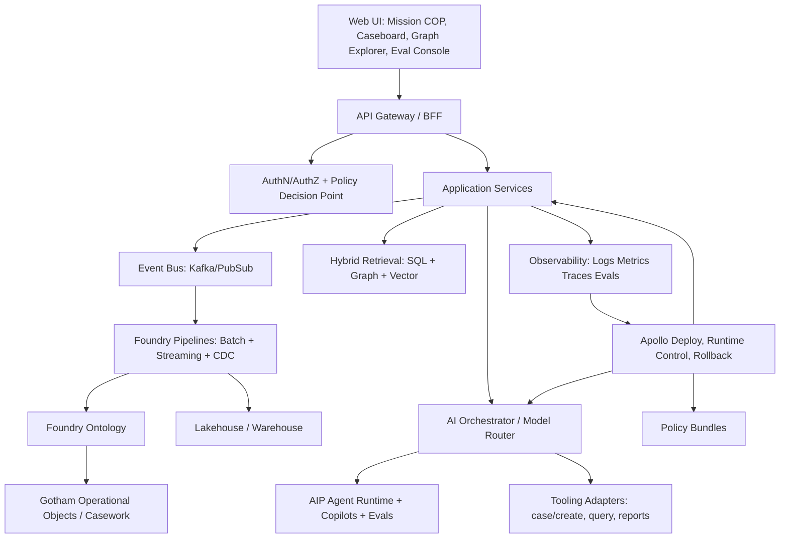
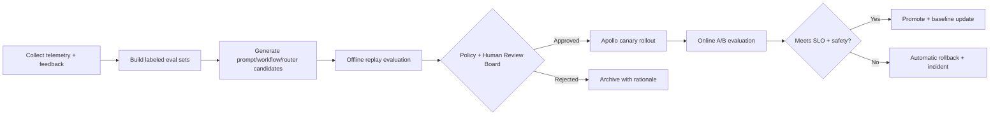

# ClearGlassInc Artemis — Self‑Evolving AI Intelligence Platform

## System Architecture

### 1) End-to-End Layer Map (Gotham + Foundry + AIP + Apollo)



### 2) Runtime Components

- **Frontend (TypeScript/React):** mission timeline, entity graph, case console, approval queues, eval dashboards.
- **API Edge:** JWT/mTLS verification, request context enrichment (mission, coalition, compartment), rate limits.
- **Backend Services (Python/FastAPI):** entity-resolution, case orchestration, recommendation service, feedback capture.
- **Streaming Layer:** Kafka topics for `intel.observation`, `intel.enriched`, `intel.recommendation`, `intel.decision`.
- **Data Layer (Foundry):** ontology-backed data products, transformation pipelines, lineage-aware objects.
- **AI Layer (AIP):** copilots + multi-agent plans + tool invocation + prompt registry + model router.
- **Deployment Layer (Apollo):** signed release bundles, ring/canary deployments, progressive rollout, emergency rollback.

### 3) Service Topology (Python-first)

```text
apps/
  api-gateway/
  services/
    entity_service/
    case_service/
    recommendation_service/
    feedback_service/
    policy_service/
    eval_service/
  ai/
    router/
    agents/
    prompts/
    evals/
  data/
    pipelines/
    ontology/
  infra/
    terraform/
    k8s/
    apollo-release/
```

---

## Data and Ontology

### 1) Canonical Ontology (Foundry)

```sql
-- Simplified SQL DDL for ontology-backed projections
CREATE TABLE entity (
  entity_id UUID PRIMARY KEY,
  entity_type TEXT NOT NULL,
  canonical_name TEXT NOT NULL,
  aliases JSONB NOT NULL DEFAULT '[]',
  confidence NUMERIC(4,3) NOT NULL,
  classification TEXT NOT NULL,
  releasability TEXT[] NOT NULL,
  first_seen_ts TIMESTAMPTZ NOT NULL,
  last_seen_ts TIMESTAMPTZ NOT NULL,
  lineage_run_id TEXT NOT NULL
);

CREATE TABLE relationship (
  relationship_id UUID PRIMARY KEY,
  src_entity_id UUID NOT NULL,
  dst_entity_id UUID NOT NULL,
  predicate TEXT NOT NULL,
  confidence NUMERIC(4,3) NOT NULL,
  valid_start_ts TIMESTAMPTZ,
  valid_end_ts TIMESTAMPTZ,
  tx_start_ts TIMESTAMPTZ NOT NULL,
  tx_end_ts TIMESTAMPTZ,
  mission_context_id UUID,
  lineage_run_id TEXT NOT NULL
);

CREATE TABLE observation (
  observation_id UUID PRIMARY KEY,
  sensor_type TEXT NOT NULL,
  source_ref TEXT NOT NULL,
  extracted_facts JSONB NOT NULL,
  extraction_model_version TEXT NOT NULL,
  source_reliability TEXT NOT NULL,
  info_credibility TEXT NOT NULL,
  confidence NUMERIC(4,3) NOT NULL,
  observed_ts TIMESTAMPTZ NOT NULL,
  tx_ingested_ts TIMESTAMPTZ NOT NULL
);
```

### 2) Ontology Behavior Contracts

- **Confidence contract:** every edge includes confidence + derivation.
- **Temporal contract:** valid-time and transaction-time required on relationships.
- **Lineage contract:** every generated record must map to pipeline run, model version, prompt hash.
- **Mission context contract:** all queries include mission scope and coalition filters.

### 3) Permissions Embedded in Ontology

```yaml
policy_dimensions:
  - clearance_level
  - compartment
  - coalition_releasability
  - mission_assignment
  - need_to_know

enforcement_points:
  - query_planner (row/column/entity filtering)
  - tool_runner (action authorization)
  - ui_renderer (field redaction)
```

---

## AI and Agent Design

### 1) Copilot Surfaces

1. **Analyst Copilot (AIP App):** hypothesis testing, link analysis, delta detection, intel drafting.
2. **Commander Copilot:** COA generation, risk/benefit matrix, resource recommendation, escalation support.

### 2) Multi-Agent Pipeline

```yaml
workflow: triage_to_action
steps:
  - ingress_agent
  - triage_agent
  - enrichment_agent
  - correlation_agent
  - recommendation_agent
  - approval_gate
  - execution_agent
  - outcome_collector
```

### 3) Tooling Contract

```python
from pydantic import BaseModel
from typing import Literal, Optional

class ToolCall(BaseModel):
    tool: Literal[
        "query_ontology", "open_case", "update_case", "generate_intel_product",
        "request_approval", "dispatch_action"
    ]
    payload: dict
    mission_context_id: str
    requested_by: str
    trace_id: str

class ToolResult(BaseModel):
    ok: bool
    data: dict
    policy_decision: Literal["allow", "deny", "escalate"]
    reason: Optional[str] = None
```

### 4) Approval Gates

- `G0` read-only, auto-allow.
- `G1` advisory output, analyst acknowledgement.
- `G2` operational changes, named approver.
- `G3` mission-significant actions, two-person integrity + immutable decision record.

---

## Self-Improvement Loop

### 1) Feedback Signals Ingested

- Analyst edits to model drafts.
- Approve/reject/modify decisions for recommendations.
- Alert outcomes (TP/FP/FN).
- Time-to-decision and mission impact metrics.
- Latency/cost/quality traces per model route.

### 2) Continuous Improvement Workflow



### 3) Drift + Rollback

- **Drift detectors:** embedding shift (KS test), class-prior shift, concept drift on outcome labels.
- **Rollback triggers:** precision drop > 5%, false-positive spike > 20%, policy violations > 0.
- **Versioning:** each prompt/workflow/router rule gets immutable semantic version and changelog.

### 4) Guardrailed Self-Upgrade Rules

```yaml
self_upgrade:
  can_propose:
    - prompt_template_patch
    - router_weight_update
    - threshold_tuning
    - workflow_step_order_change
  cannot_change:
    - mission_objectives
    - approval_gate_requirements
    - policy_baselines
    - coalition_release_rules
  mandatory_human_approval: true
```

---

## Full-Stack Implementation Blueprint

### 1) Web UI (React + TypeScript)

- Views: live event stream, knowledge graph, case timeline, recommendation queue, approval inbox.
- Components: confidence chips, provenance cards, action diff panel, “why this recommendation” evidence drawer.
- Realtime: WebSocket/SSE for event and decision updates.

### 2) API Gateway / BFF

- `POST /v1/copilot/query`
- `POST /v1/recommendations/{id}/decision`
- `GET /v1/cases/{id}/timeline`
- `GET /v1/entities/{id}/graph?depth=2`

### 3) Backend Microservices (FastAPI)

```python
# services/recommendation_service/main.py
from fastapi import FastAPI, Depends, HTTPException
from pydantic import BaseModel
from .policy import authorize_action
from .router import route_model
from .tools import run_tool

app = FastAPI(title="ClearGlassInc Artemis Recommendation Service")

class RecommendationRequest(BaseModel):
    mission_context_id: str
    operator_id: str
    alert_id: str
    objective: str

@app.post("/v1/recommend")
def recommend(req: RecommendationRequest):
    decision = authorize_action(req.operator_id, "recommend.generate", req.mission_context_id)
    if decision != "allow":
        raise HTTPException(403, "policy denied")

    model = route_model(task="recommendation", mission=req.mission_context_id)
    synthesis = run_tool("query_ontology", {"alert_id": req.alert_id, "depth": 2})
    output = model.generate(
        prompt=f"Objective: {req.objective}\nEvidence:{synthesis}",
        temperature=0.1,
    )
    return {"recommendation": output.text, "model": model.name, "trace": output.trace_id}
```

### 4) Event-Driven Processing

```python
# services/triage_worker/handler.py
import json
from kafka import KafkaConsumer, KafkaProducer

consumer = KafkaConsumer("intel.observation", bootstrap_servers=["kafka:9092"])
producer = KafkaProducer(bootstrap_servers=["kafka:9092"])

for msg in consumer:
    obs = json.loads(msg.value)
    triage_score = 0.6 * obs["threat_score"] + 0.4 * obs["source_confidence"]
    topic = "intel.priority" if triage_score >= 0.75 else "intel.enrichment"
    producer.send(topic, json.dumps({**obs, "triage_score": triage_score}).encode())
```

### 5) Model Router

```python
# ai/router/router.py
from dataclasses import dataclass

@dataclass
class RoutePolicy:
    max_latency_ms: int
    min_quality: float
    max_cost_per_call: float

MODEL_REGISTRY = {
    "fast-small": {"latency": 250, "quality": 0.78, "cost": 0.001},
    "balanced":   {"latency": 700, "quality": 0.88, "cost": 0.004},
    "deep-reason": {"latency": 1800, "quality": 0.94, "cost": 0.012},
}

def route_model(task: str, mission: str, policy: RoutePolicy = RoutePolicy(1000, 0.86, 0.006)):
    candidates = []
    for name, m in MODEL_REGISTRY.items():
        if m["latency"] <= policy.max_latency_ms and m["quality"] >= policy.min_quality and m["cost"] <= policy.max_cost_per_call:
            candidates.append((name, m))
    chosen = sorted(candidates, key=lambda x: (x[1]["quality"], -x[1]["latency"]), reverse=True)[0][0]
    return type("Model", (), {"name": chosen, "generate": lambda self, prompt, temperature: type("R", (), {"text": "COA-2 recommended", "trace_id": "trc-123"})()})()
```

### 6) Policy-as-Code (OPA/Rego)

```rego
package artemis.authz

default allow = false

allow {
  input.action == "recommend.generate"
  input.user.clearance >= input.resource.classification
  input.user.mission_ids[_] == input.resource.mission_context_id
  input.user.coalition in input.resource.releasability
}
```

### 7) Eval Pipeline

```python
# ai/evals/run_eval.py
from statistics import mean

def score_case(pred, truth):
    return {
        "precision": pred["tp"] / max(pred["tp"] + pred["fp"], 1),
        "recall": pred["tp"] / max(pred["tp"] + pred["fn"], 1),
        "latency_ms": pred["latency_ms"],
        "trust": pred.get("operator_trust", 0.0),
    }

def evaluate(candidate_name: str, dataset: list[dict]):
    metrics = [score_case(d["pred"], d["truth"]) for d in dataset]
    return {
        "candidate": candidate_name,
        "precision": mean([m["precision"] for m in metrics]),
        "recall": mean([m["recall"] for m in metrics]),
        "p95_latency_ms": sorted([m["latency_ms"] for m in metrics])[int(len(metrics)*0.95)-1],
        "trust": mean([m["trust"] for m in metrics]),
    }
```

---

## Security and Governance

- **Need-to-know enforcement:** ABAC+ReBAC with mission-scoped claims.
- **Entity/row/column controls:** query-time filtering + render-time masking.
- **Compartment boundaries:** coalition-aware partitions and release labels.
- **Zero-trust runtime:** mTLS, workload identity, signed artifacts, no implicit trust between services.
- **Immutable provenance:** append-only audit ledger for prompts, tool calls, decisions, and deployments.
- **Model governance:** approved model registry, use restrictions, expiration windows, automated re-certification.
- **Prompt governance:** template signatures, diff review, red-team checks, promotion gates.

---

## Code Examples (Extended)

```python
# services/feedback_service/main.py
from fastapi import FastAPI
from pydantic import BaseModel
from datetime import datetime

app = FastAPI()

class Feedback(BaseModel):
    recommendation_id: str
    operator_id: str
    action: str  # approved|rejected|modified
    rationale: str
    mission_outcome: dict

@app.post("/v1/feedback")
def submit_feedback(f: Feedback):
    event = {
        "type": "intel.decision",
        "ts": datetime.utcnow().isoformat(),
        **f.model_dump(),
    }
    # publish to event bus + write immutable ledger
    return {"status": "accepted", "event": event}
```

```typescript
// ui/src/components/ApprovalPanel.tsx
export function ApprovalPanel({ rec, onDecision }: any) {
  return (
    <div className="approval-panel">
      <h3>Operational Recommendation</h3>
      <pre>{rec.text}</pre>
      <button onClick={() => onDecision("approved")}>Approve</button>
      <button onClick={() => onDecision("modified")}>Modify</button>
      <button onClick={() => onDecision("rejected")}>Reject</button>
    </div>
  );
}
```

```sql
-- Ontology-driven retrieval for last 6h network changes
SELECT r.src_entity_id, r.dst_entity_id, r.predicate, r.confidence, r.tx_start_ts
FROM relationship r
JOIN mission_context m ON r.mission_context_id = m.id
WHERE m.operation_name = 'Artemis-Delta'
  AND r.tx_start_ts >= NOW() - INTERVAL '6 hours'
  AND r.confidence >= 0.70
ORDER BY r.tx_start_ts DESC;
```

---

## Scenario Walkthrough (Cinematic + Technical)

1. **00:00:07 UTC** — A SIGINT observation enters `intel.observation` with high anomaly score.
2. **00:00:09 UTC** — Triage agent raises priority to 0.83 and routes to enrichment.
3. **00:00:13 UTC** — Correlation agent links device, account, and vehicle nodes; graph confidence crosses escalation threshold.
4. **00:00:16 UTC** — Recommendation agent proposes COA‑2 (“shadow-track + selective interdiction”) with evidence packet.
5. **00:00:20 UTC** — Because COA‑2 is `G2`, platform requests named operator approval in Gotham case workspace.
6. **00:00:41 UTC** — Operator modifies geofence radius and approves.
7. **00:00:42 UTC** — Action execution agent dispatches workflow run; immutable decision + policy trace written.
8. **+45 min** — Outcome collector records reduced false positives and improved intercept timing.
9. **+4 hours nightly eval window** — Self-improvement pipeline compares original vs modified recommendation template; candidate prompt B wins on precision (+4.2%), trust (+6.1%), latency unchanged.
10. **Next release ring** — Human review board approves candidate; Apollo canary deploys to 10%; no regressions; promotion to 100%.

**Result:** ClearGlassInc Artemis continuously improves prompts, routing, and workflow ordering under explicit human governance, with mission safety and auditability preserved.
