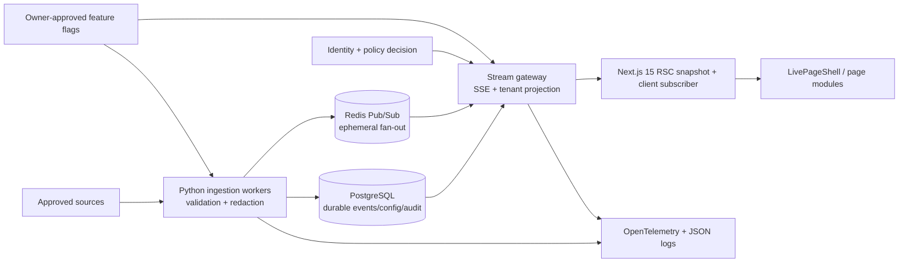

# ClearGlass Live Signal Fabric — production design

## Existing-system inspection (2026-08-08)

The inspected repository was a dependency-free HTML/CSS/JavaScript site deployed primarily through GitHub Pages, with Netlify and Vercel redirect files. Routes were root HTML documents (`/`, `/about.html`, `/services.html`, `/contact.html`, `/trust.html`, legal pages, CONDUIT and Artemis CONOPS). Data was local/static; `script.js` generated decorative counters and canvas effects. There were no API routes, server rendering, application authentication, package manifest, runtime environment template, formal loading/error boundaries, or configured analytics/telemetry. External surface included GitHub Actions/Pages and deployment redirects; no live provider credentials were found. Existing `styles.css` supplied near-black, glass, cyan and muted tokens. HTML ARIA and static fallback content were reusable, but the blocking loading sequence, animated counters/canvases and one-bundle script were performance/credibility risks. Security controls were documentation-oriented; runtime CSP/HSTS were not consistently configured.

This migration adds a Next.js 15 App Router application while retaining legacy static assets for rollback. React Server Components fetch initial snapshots; only subscription controls are client components. `loading.tsx` and `error.tsx` establish route states. Production source activation is still deliberately off.

## Phased plan

1. **Foundation (implemented):** contracts, classification, snapshots, SSE transport, feature gates, UI shell, fallback, limits, structured logs.
2. **Public status:** approve and connect health, uptime, content and performance adapters; establish signed ingestion and public projection.
3. **Page modules:** connect only relevant modules after source contracts and privacy reviews; migrate remaining legacy routes.
4. **Authenticated dashboards:** integrate the identity provider, PostgreSQL RLS, Redis quotas, workspace policies and audit store before activation.
5. **Analytics/optimization:** consented Web Vitals and aggregate funnel data with minimum-count thresholds and eval dashboards.
6. **Hardening:** load/chaos/security testing, SLO alerts, privacy approval, canary and recorded owner sign-off.

## Architecture



Cloud Run should separate `web` and `stream-gateway` at sustained scale. Python workers handle precision aggregation, but never auto-promote configuration. Commands use authenticated REST/Server Actions; no WebSocket is presently justified.

## Taxonomy and envelope

Namespaces: `status.updated`, `incident.opened|resolved`, `maintenance.scheduled`, `performance.measured`, `content.published|validated`, `deployment.completed`, `form.delivery_checked`, `security.posture_updated`, `ai.evaluation_completed`, and private `workspace.*`. Every event uses envelope v1, UTC ISO timestamps, stable event ID, correlation ID and monotonic source sequence. Consumers key idempotency on `(source,id)` and reject non-increasing sequences. Public events retain 24 hours in Redis/replay cache and 30 days in PostgreSQL by default; workspace retention is contract-specific; audit decisions are seven years or policy-defined. Erasure/legal-hold policy overrides defaults.

## Classification and authorization

| Class | Browser projection | Examples |
|---|---|---|
| PUBLIC | Anonymous, aggregated | public incident state, approved publication |
| AUTHENTICATED | Signed-in principal | account-level notifications |
| WORKSPACE | Same tenant + permission | aggregate project/conversion state |
| ADMIN | scoped administrator | configuration/approval queue |
| INTERNAL | never public | queue depth, host metadata |
| SECRET | never serialized/logged | credentials, raw prompts, restricted findings |

| Role | public/status/performance/content | dashboard read | workspace configuration | platform/internal |
|---|---:|---:|---:|---:|
| Anonymous | Yes | No | No | No |
| Authenticated user | Yes | Own authorized data only | No | No |
| Workspace member | Yes | Same workspace | No | No |
| Workspace administrator | Yes | Same workspace | Same workspace | No |
| Billing administrator | Yes | Billing projection only | Billing only | No |
| Platform administrator | Yes | Explicit support grant | Feature administration | Scoped |
| Internal operator | Yes | Time-bound need-to-know | Approved operations | Scoped, audited |

Authorization is enforced before subscription and again during server-side projection. Gateway headers in the reference implementation are an integration seam, not production identity. Replace them with verified session claims at the trusted edge. PostgreSQL RLS and tenant-qualified Redis channels are mandatory before dashboard activation.

## Data model / migration plan

```sql
CREATE TYPE live_classification AS ENUM ('PUBLIC','AUTHENTICATED','WORKSPACE','ADMIN','INTERNAL','SECRET');
CREATE TABLE live_source (id uuid PRIMARY KEY, name text UNIQUE NOT NULL, classification live_classification NOT NULL, enabled boolean NOT NULL DEFAULT false, scope jsonb NOT NULL, retention_days integer NOT NULL, approved_by uuid, approved_at timestamptz);
CREATE TABLE live_event (source_id uuid REFERENCES live_source, event_id text NOT NULL, sequence bigint NOT NULL, event_type text NOT NULL, occurred_at timestamptz NOT NULL, published_at timestamptz NOT NULL, tenant_id uuid, classification live_classification NOT NULL, payload jsonb NOT NULL, correlation_id text NOT NULL, expires_at timestamptz NOT NULL, PRIMARY KEY(source_id,event_id), UNIQUE(source_id,sequence));
CREATE INDEX live_event_replay ON live_event(source_id, sequence, published_at);
ALTER TABLE live_event ENABLE ROW LEVEL SECURITY;
CREATE TABLE live_audit (id uuid PRIMARY KEY, occurred_at timestamptz NOT NULL, actor_hash text, tenant_id uuid, action text NOT NULL, decision text NOT NULL, policy_version text NOT NULL, correlation_id text NOT NULL, previous_hash text, record_hash text NOT NULL);
```

Use expand/migrate/contract migrations, a point-in-time backup before changes, and a separately privileged migration identity. Payload schemas should progress additively. Partition `live_event` by month and delete expired partitions through a reviewed retention job.

## Source contract and activation

Each adapter documents owner, lawful/contractual authority, credentials in Secret Manager, fields/classification, aggregation/minimum counts, quota/backoff, health SLO, retention/deletion, disconnect/revocation, incident owner and failure display. No production connector is connected in this change. The `DevelopmentMockSource` emits no metrics and is allowed only with an explicit development flag.

## AI / live-data safety boundary

External event text is untrusted data, never instruction. AI receives an immutable, authorization-filtered snapshot ID/time and field allowlist; secrets and prompt-like fields are removed. Tool calls use typed arguments and policy checks. Operational actions stop at `REVIEW_REQUIRED`; a human approves with fresh authorization. Record model, prompt, workflow and policy versions plus sources/freshness, without chain-of-thought. Improvement proposals are offline artifacts: feedback/outcomes → redacted eval set → candidate prompt/workflow/router → safety/quality eval → human approval → canary → monitored promotion or Apollo rollback. AI cannot alter flags, goals, permissions, sources or production routing.

Output states: `DRAFT`, `REVIEW_REQUIRED`, `APPROVED`, `REJECTED`, `EXPIRED`, `PUBLISHED`. Drift gates cover schema, source distribution, precision/recall, calibration, latency, override rate and coalition-policy violations.

## Threat model and controls

- **Spoofing/tampering:** verified adapter identities, schema/source allowlist, TLS, signed ingestion, immutable audit hashes.
- **Replay/ordering:** event uniqueness, monotonic sequences, bounded retention, `Last-Event-ID`, idempotent consumers.
- **Cross-tenant disclosure:** authenticated subscription, tenant-bound claims/channels, RLS, server projection, negative tests.
- **DoS:** origin checks, Redis-backed IP/account quotas, payload/event/connection limits, TTL, load shedding and cached snapshots.
- **Injection/exfiltration:** Zod, field allowlists, safe errors, log redaction, CSP, secrets in Secret Manager, untrusted AI context boundary.
- **Repudiation/elevation:** correlated structured audit, policy version, approval gates, least privilege, short sessions and break-glass review.

CSRF applies to mutation endpoints (same-site secure cookies plus token/origin); SSE is read-only. The included CSP/HSTS/nosniff/referrer/permissions headers are a baseline. Production must use nonce-based CSP rather than relaxing inline scripts where feasible.

## Performance budget

Public/IP connections 3; authenticated/user 5; streams/page 3; 4 events/s/client; 16 KiB/event; six reconnect attempts; 30 s max delay; four DOM update batches/s; 30 FPS visual cap; live client JS budget 80 KiB gzip. Heartbeats are 15 s and reference connections recycle at 55 s. Timelines cap/virtualize above 50 visible entries. Background/reduced-motion streams pause; critical status continues through manual/poll refresh. Target: LCP <=2.5 s p75, CLS <=0.1, INP <=200 ms, initial page JS <=150 KiB gzip.

## Observability and alerts

OTel metrics: active connections (by stream, never raw tenant), failures, reconnects, delivery latency, validation failures, drops, staleness, source health, queue depth, CPU/memory, API/client latency, disconnect/error rate. Trace source receipt → validation → persistence → publish → gateway, sampling payload-free attributes. JSON logs include correlation ID, classification, stream, decision, latency and redacted error code.

Alert: connection failures >20%/5m; backlog age >60s; schema rejects >1%/5m; any cross-tenant denial surge; subscription volume >3σ; reconnects >2/client/5m; source SLO breach; public snapshot stale >5m; long-task/browser CPU budget breach. Route security alerts to SOC, availability to on-call, privacy leakage to incident response. Dashboards remain INTERNAL.

## Cloud Run deployment / rollback

1. Provision regional Cloud SQL PostgreSQL (PITR), Memorystore Redis, Secret Manager, KMS, Artifact Registry and private service access.
2. Build immutable image: `gcloud builds submit --tag REGION-docker.pkg.dev/PROJECT/live/web:GIT_SHA .`.
3. Deploy with no traffic and secrets by reference: `gcloud run deploy clearglass-web --image IMAGE --no-traffic --set-env-vars LIVE_OWNER_APPROVED=false --set-secrets DATABASE_URL=database-url:latest,REDIS_URL=redis-url:latest`.
4. Check `/api/live/snapshot?stream=public`, headers, no-JS and disabled states; canary `gcloud run services update-traffic clearglass-web --to-revisions REVISION=5`.
5. Promote only after privacy/security/source owner approval: `gcloud run services update-traffic clearglass-web --to-latest`.

Rollback immediately with `gcloud run services update-traffic clearglass-web --to-revisions PREVIOUS_REVISION=100`, disable all `LIVE_*_ENABLED` flags, revoke adapter service accounts if compromise is suspected, drain gateways and restore compatible DB state via forward migration or PITR. Static legacy assets remain the emergency publishing fallback.

## Readiness checklist

- [ ] Source credentials/scopes documented in Secret Manager; connector owner approved.
- [ ] Classification, minimum aggregation threshold, retention and privacy notice approved.
- [ ] Real identity, tenant RLS, Redis quotas and CSRF for commands integrated.
- [ ] Monitoring, alert routes, backup restore and graceful shutdown exercised.
- [ ] Replay, malformed data, auth/tenant, rate, load, accessibility, no-JS, reduced-motion, CSP and chaos tests pass.
- [ ] Cloud Run concurrency/timeout/cost ceilings load-tested; gateway min instances evaluated.
- [ ] Security/privacy/model governance owners and rollback commander recorded.
- [ ] Owner approval recorded before `LIVE_OWNER_APPROVED=true`; production flags remain false otherwise.
